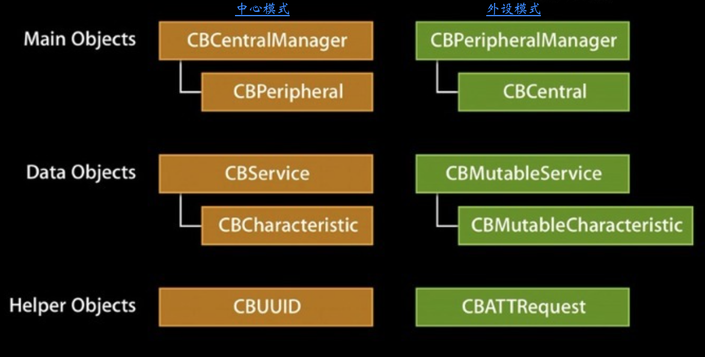

##CoreBluetooth

### 1.基础知识

#### 1.1专业名词

- MFI：make for ipad，iphone，itouch 为苹果设备制作的设备，开发使用ExternalAccessory 框架
- BLE：buletouch low energy，蓝牙4.0设备因为低耗电，所以也叫做BLE，开发使用CoreBluetooth 框架
- peripheral\central：外设和中心,发起连接的是central，被连接的设备为perilheral
- service and characteristic：每每个外设会有很多服务，每个服务中包含很多字段，这些字段的权限一般分为 读read，写write，通知notiy几种，就是我们连接设备后具体需要操作的内容。
- Description 每个characteristic可以对应一个或多个Description用户描述characteristic的信息或属性
- GAAT : Generic Attribute Profile , GATT配置文件是一个通用规范，用于在BLE链路上发送和接收被称为“属性”的数据块。目前所有的BLE应用都基于GATT。 蓝牙SIG规定了许多低功耗设备的配置文件。配置文件是设备如何在特定的应用程序中工作的规格说明。注意一个设备可以实现多个配置文件。例如，一个设备可能包括心率监测仪和电量检测。

#### 1.2基础知识

越狱设备对应蓝牙版本为BLE 2.0， iOS6设备对应BLE4.0。MFI认证设备没有版本限制。CoreBluetooth框架核心内容为外设模式和中心模式。
	
- 外设模式：以app为中心，连接其他外设的场景。
- 中心模式：使用手机作为外设设备。
- 服务：service，每个设备都会有一些服务，类似功能模块。每个服务会有一些特征，对应具体功能。
- 特征：characteristic，服务里的具体键值对，提供数据的地方。每个特征属性分为读、写、通知三种方式。一个characteristic包括一个单一变量和0-n个用来描述characteristic变量的descriptor，characteristic可以被认为是一个类型，类 似于类。
- Description：用来描述characteristic变量的属性。例如，一个descriptor可以规定一个可读的描述，或者一个characteristic变量可接受的范围，或者一个characteristic变量特定的测量单位。 
特征属性：
```
  typedef NS_OPTIONS(NSUInteger, CBCharacteristicProperties) {
  CBCharacteristicPropertyBroadcast												= 0x01,
  CBCharacteristicPropertyRead													= 0x02,
  CBCharacteristicPropertyWriteWithoutResponse									= 0x04,
  CBCharacteristicPropertyWrite													= 0x08,
  CBCharacteristicPropertyNotify													= 0x10,
  CBCharacteristicPropertyIndicate												= 0x20,
  CBCharacteristicPropertyAuthenticatedSignedWrites								= 0x40,
  CBCharacteristicPropertyExtendedProperties										= 0x80,
  CBCharacteristicPropertyNotifyEncryptionRequired NS_ENUM_AVAILABLE(NA, 6_0)		= 0x100,
  CBCharacteristicPropertyIndicateEncryptionRequired NS_ENUM_AVAILABLE(NA, 6_0)	= 0x200
};
```

#### 1.3两种模式

两种模式下的API：


##### 1.3.1中心模式

```
流程：
1. 建立中心角色
2. 扫描外设（discover）
3. 连接外设(connect)
4. 扫描外设中的服务和特征(discover)
    - 4.1 获取外设的services
    - 4.2 获取外设的Characteristics,获取Characteristics的值，获取Characteristics的Descriptor和Descriptor的值
5. 与外设做数据交互(explore and interact)
6. 订阅Characteristic的通知
7. 断开连接(disconnect)
```

##### 1.3.2外设模式

```
流程：
1. 启动一个Peripheral管理对象
2. 本地Peripheral设置服务,特性,描述，权限等等
3. Peripheral发送广告
4. 设置处理订阅、取消订阅、读characteristic、写characteristic的委托方法
```
#### 1.4状态

##### 1.4.1设备状态

- 待机状态（standby）：设备没有传输和发送数据，并且没有连接到任何中心
- 广播状态（Advertiser）：周期性广播状态
- 扫描状态（Scanner）：主动寻找正在广播的设备
- 发起链接状态（Initiator）：主动向扫描设备发起连接。
- 主设备（Master）：作为主设备连接到其他设备。
- 从设备（Slave）：作为从设备连接到其他设备。

##### 1.4.2工作状态

- 准备（standby）
- 广播（advertising）
- 监听扫描（Scanning
- 发起连接（Initiating）
- 已连接（Connected）

