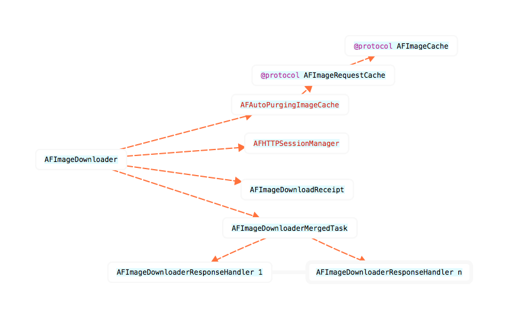

## AFImageDownloader

结构图：



下载器组成结构：

- 持有一个缓存器  `id <AFImageRequestCache> imageCache`管理图片缓存
- 一个会话管理器	`AFHTTPSessionManager *sessionManager`负责图片下载
- 一个任务持有对象	`AFImageDownloadReceipt `用于任务取消和唯一性判断
- 一个成功与失败回调对象	`AFImageDownloaderResponseHandler `持有任务的success和failure回调，方便同一URL多次请求的管理
- 一个任务合成对象	`AFImageDownloaderMergedTask `为每一个URL请求建立该mergedTask，持有所有相同URL请求的AFImageDownloaderResponseHandler对象

### AFImageDownloadReceipt

AFImageDownloader在启动一个任务时会创建一个对应的AFImageDownloadReceipt来保存task和一个唯一的identifier。这样就可以直接通过receipt对象来取消task，同时也可以区分相同的请求任务。

`@property (nonatomic, strong) NSURLSessionDataTask *task;`

//用于区分相同的请求任务，使用随机字符串`[NSUUID UUDI]`
`@property (nonatomic, strong) NSUUID *receiptID;`

### AFImageDownloaderResponseHandler

管理下载的successhefailure的block回调，使用uuid作为唯一标志与task绑定

```
@interface AFImageDownloaderResponseHandler : NSObject
@property (nonatomic, strong) NSUUID *uuid;
@property (nonatomic, copy) void (^successBlock)(NSURLRequest*, NSHTTPURLResponse*, UIImage*);
@property (nonatomic, copy) void (^failureBlock)(NSURLRequest*, NSHTTPURLResponse*, NSError*);
@end
```

### AFImageDownloaderMergedTask

记录同一请求的task和响应标志，以及对应的所有succes和failure回调对象的集合。

```
@interface AFImageDownloaderMergedTask : NSObject

//URL的唯一标识
@property (nonatomic, strong) NSString *URLIdentifier;
//task的标识
@property (nonatomic, strong) NSUUID *identifier;
//请求任务
@property (nonatomic, strong) NSURLSessionDataTask *task;
//相同请求下的所有任务对应的success和failure回调对象
@property (nonatomic, strong) NSMutableArray <AFImageDownloaderResponseHandler*> *responseHandlers;

@end
```

### AFImageDownloader

#### 属性管理

缓存器
@property (nonatomic, strong, nullable) id <AFImageRequestCache> imageCache;

会话管理
@property (nonatomic, strong) AFHTTPSessionManager *sessionManager;

通过修改downloadPrioritizaton来设置任务添加进队列的执行策略
`@property (nonatomic, assign) AFImageDownloadPrioritization downloadPrioritizaton;`

```
typedef NS_ENUM(NSInteger, AFImageDownloadPrioritization) {
    AFImageDownloadPrioritizationFIFO,
    AFImageDownloadPrioritizationLIFO
};
```

私有属性

```
//请求发起的串行队列
@property (nonatomic, strong) dispatch_queue_t synchronizationQueue;
//请求响应的并行处理队列
@property (nonatomic, strong) dispatch_queue_t responseQueue;

//最大下载并发数
@property (nonatomic, assign) NSInteger maximumActiveDownloads;
//当前活动状态的请求数
@property (nonatomic, assign) NSInteger activeRequestCount;

//合并任务队列
@property (nonatomic, strong) NSMutableArray *queuedMergedTasks;
//合并的任务，使用URLString作为identiferKey
@property (nonatomic, strong) NSMutableDictionary *mergedTasks;
```

#### 初始化

默认设置

```
+ (NSURLCache *)defaultURLCache {
    return [[NSURLCache alloc] initWithMemoryCapacity:20 * 1024 * 1024
                                         diskCapacity:150 * 1024 * 1024
                                             diskPath:@"com.alamofire.imagedownloader"];
}

+ (NSURLSessionConfiguration *)defaultURLSessionConfiguration {
    NSURLSessionConfiguration *configuration = [NSURLSessionConfiguration defaultSessionConfiguration];

    //TODO set the default HTTP headers

    configuration.HTTPShouldSetCookies = YES;
    configuration.HTTPShouldUsePipelining = NO;

    configuration.requestCachePolicy = NSURLRequestUseProtocolCachePolicy;
    configuration.allowsCellularAccess = YES;
    configuration.timeoutIntervalForRequest = 60.0;
    configuration.URLCache = [AFImageDownloader defaultURLCache];

    return configuration;
}
```

采用图片解析器 

```
sessionManager.responseSerializer = [AFImageResponseSerializer serializer];
```

最大下载并发数

```
[self initWithSessionManager:sessionManager
                 downloadPrioritization:AFImageDownloadPrioritizationFIFO
                 maximumActiveDownloads:4
                             imageCache:[[AFAutoPurgingImageCache alloc] init]];
```


#### 任务开启

对于重复的请求无法控制，队列中已经存在相同任务，则相应的success和failure会被与已经存在的task绑定，任务完成时，所有的success和failure都会被执行

```
//receiptID可以用来区分不同的request，以此执行不同的success和failure
- (nullable AFImageDownloadReceipt *)downloadImageForURLRequest:(NSURLRequest *)request
                                                 withReceiptID:(NSUUID *)receiptID
                                                        success:(nullable void (^)(NSURLRequest *request, NSHTTPURLResponse  * _Nullable response, UIImage *responseObject))success
                                                        failure:(nullable void (^)(NSURLRequest *request, NSHTTPURLResponse * _Nullable response, NSError *error))failure;
```   

##### 启动任务步骤

- 任务的启动采用了dispatch_sync(self.synchronizationQueue, ^{}）;串行同步的处理方式
- 任务的回调采用 dispatch_async(self.responseQueue, ^{}); 异步并行的处理方式

1.验证request是否合法

```
//请求URLString，作为存储mergeTask的key。同时作为任务的唯一标识
NSString *URLIdentifier = request.URL.absoluteString;
if (URLIdentifier == nil) {
    if (failure) {
        NSError *error = [NSError errorWithDomain:NSURLErrorDomain code:NSURLErrorBadURL userInfo:nil];
        dispatch_async(dispatch_get_main_queue(), ^{
            failure(request, nil, error);
        });
    }
    return;
}
```

2.存在相同的请求则创建AFImageDownloaderResponseHandler，将该任务的回调对象添加到存在的合并任务中，等待existing-task执行结束回调所有任务的block

```
AFImageDownloaderMergedTask *existingMergedTask = self.mergedTasks[URLIdentifier];
if (existingMergedTask != nil) {
    AFImageDownloaderResponseHandler *handler = [[AFImageDownloaderResponseHandler alloc] initWithUUID:receiptID success:success failure:failure];
    [existingMergedTask addResponseHandler:handler];
    task = existingMergedTask.task;
    return;
}
```

3.该请求是独立发出，则检测是否使用缓存，使用则查询缓存容器，有图片则返回success回调

```
switch (request.cachePolicy) {
    case NSURLRequestUseProtocolCachePolicy:
    case NSURLRequestReturnCacheDataElseLoad:
    case NSURLRequestReturnCacheDataDontLoad: {
        UIImage *cachedImage = [self.imageCache imageforRequest:request withAdditionalIdentifier:nil];
        if (cachedImage != nil) {
            if (success) {
                dispatch_async(dispatch_get_main_queue(), ^{
                    success(request, nil, cachedImage);
                });
            }
            return;
        }
        break;
    }
    default:
        break;
}
```

4.使用UUID作为请求的唯一标识，用sessionManager创建请求任务

```
NSUUID *mergedTaskIdentifier = [NSUUID UUID];
        NSURLSessionDataTask *createdTask;
        __weak __typeof__(self) weakSelf = self;

        createdTask = [self.sessionManager
                       dataTaskWithRequest:request
                       completionHandler:^(NSURLResponse * _Nonnull response, id  _Nullable responseObject, NSError * _Nullable error) {
                           
                           dispatch_async(self.responseQueue, ^{
                               
                               __strong __typeof__(weakSelf) strongSelf = weakSelf;
                               
                               //验证该请求回调是否是该任务的
                               AFImageDownloaderMergedTask *mergedTask = self.mergedTasks[URLIdentifier];
                               if ([mergedTask.identifier isEqual:mergedTaskIdentifier]) {
                                   //任务完成移除该mergedTask
                                   mergedTask = [strongSelf safelyRemoveMergedTaskWithURLIdentifier:URLIdentifier];
                                   if (error) {
                                       //请求报错则调用所有failure回调
                                       for (AFImageDownloaderResponseHandler *handler in mergedTask.responseHandlers) {
                                           if (handler.failureBlock) {
                                               dispatch_async(dispatch_get_main_queue(), ^{
                                                   handler.failureBlock(request, (NSHTTPURLResponse*)response, error);
                                               });
                                           }
                                       }
                                   } else {
                                       //请求成功则缓存该图片
                                       [strongSelf.imageCache addImage:responseObject forRequest:request withAdditionalIdentifier:nil];
                                       //调用所有成功回调
                                       for (AFImageDownloaderResponseHandler *handler in mergedTask.responseHandlers) {
                                           if (handler.successBlock) {
                                               dispatch_async(dispatch_get_main_queue(), ^{
                                                   handler.successBlock(request, (NSHTTPURLResponse*)response, responseObject);
                                               });
                                           }
                                       }
                                       
                                   }
                               }
                               //递减活动任务数
                               [strongSelf safelyDecrementActiveTaskCount];
                               //尝试启动下一个任务
                               [strongSelf safelyStartNextTaskIfNecessary];
                           });
                       }];
```

5.独立任务创建mergedTask并保存

```
AFImageDownloaderResponseHandler *handler = [[AFImageDownloaderResponseHandler alloc] initWithUUID:receiptID
                                                                                                   success:success
                                                                                                   failure:failure];
        AFImageDownloaderMergedTask *mergedTask = [[AFImageDownloaderMergedTask alloc]
                                                   initWithURLIdentifier:URLIdentifier
                                                   identifier:mergedTaskIdentifier
                                                   task:createdTask];
        [mergedTask addResponseHandler:handler];
        self.mergedTasks[URLIdentifier] = mergedTask;
```

6.检查当前请求并发数，尝试启动，不能则先入队等待下次启动

```
if ([self isActiveRequestCountBelowMaximumLimit]) {
    [self startMergedTask:mergedTask];
} else {
    [self enqueueMergedTask:mergedTask];
}
task = mergedTask.task;
```

7.返回AFImageDownloadReceipt对象，用于取消task

```
if (task) {
    return [[AFImageDownloadReceipt alloc] initWithReceiptID:receiptID task:task];
} else {
    return nil;
}
 ```

#### 取消任务

- 移除success和failure回调block，并取消receipt中的task
- 没有success和failure回调的任务，如果在排队中则可以被取消。如果已经执行或正在执行则会继续。
- 在dispatch_sync(self.synchronizationQueue, ^{}）中进行处理
`- (void)cancelTaskForImageDownloadReceipt:(AFImageDownloadReceipt *)imageDownloadReceipt;`

1.获取合并任务和查询与receipt对应的responseHandler是否在该合并任务中

```
NSString *URLIdentifier = imageDownloadReceipt.task.originalRequest.URL.absoluteString;
AFImageDownloaderMergedTask *mergedTask = self.mergedTasks[URLIdentifier];
NSUInteger index = [mergedTask.responseHandlers indexOfObjectPassingTest:^BOOL(AFImageDownloaderResponseHandler * _Nonnull handler, __unused NSUInteger idx, __unused BOOL * _Nonnull stop) {
    return handler.uuid == imageDownloadReceipt.receiptID;
}];
```

2.任务在等待队列中

```
if (index != NSNotFound) {
    //移除与receipt对应的responseHandler
    AFImageDownloaderResponseHandler *handler = mergedTask.responseHandlers[index];
    [mergedTask removeResponseHandler:handler];
    //调用failure回答，返回NSURLErrorCancelled错误
    NSString *failureReason = [NSString stringWithFormat:@"ImageDownloader cancelled URL request: %@",imageDownloadReceipt.task.originalRequest.URL.absoluteString];
    NSDictionary *userInfo = @{NSLocalizedFailureReasonErrorKey:failureReason};
    NSError *error = [NSError errorWithDomain:NSURLErrorDomain code:NSURLErrorCancelled userInfo:userInfo];
    if (handler.failureBlock) {
        dispatch_async(dispatch_get_main_queue(), ^{
            handler.failureBlock(imageDownloadReceipt.task.originalRequest, nil, error);
        });
    }
}
```

3.合并任务中的响应集合为空并且任务状态为suspend状态，说明该任务时独立任务没有重复，可以直接取消并移出队列

```
if (mergedTask.responseHandlers.count == 0 && mergedTask.task.state == NSURLSessionTaskStateSuspended) {
    [mergedTask.task cancel];
    [self removeMergedTaskWithURLIdentifier:URLIdentifier];
}
```

#### 合并任务管理

`采用在串行队列中同步执行，保证队列的线程访问安全`

移除合并任务

```
- (AFImageDownloaderMergedTask*)safelyRemoveMergedTaskWithURLIdentifier:(NSString *)URLIdentifier {
    __block AFImageDownloaderMergedTask *mergedTask = nil;
    dispatch_sync(self.synchronizationQueue, ^{
        mergedTask = [self removeMergedTaskWithURLIdentifier:URLIdentifier];
    });
    return mergedTask;
}

//This method should only be called from safely within the synchronizationQueue
- (AFImageDownloaderMergedTask *)removeMergedTaskWithURLIdentifier:(NSString *)URLIdentifier {
    AFImageDownloaderMergedTask *mergedTask = self.mergedTasks[URLIdentifier];
    [self.mergedTasks removeObjectForKey:URLIdentifier];
    return mergedTask;
}
```

执行下一个任务

```
- (void)safelyStartNextTaskIfNecessary {
    dispatch_sync(self.synchronizationQueue, ^{
        if ([self isActiveRequestCountBelowMaximumLimit]) {
            while (self.queuedMergedTasks.count > 0) {
                AFImageDownloaderMergedTask *mergedTask = [self dequeueMergedTask];
                if (mergedTask.task.state == NSURLSessionTaskStateSuspended) {
                    [self startMergedTask:mergedTask];
                    break;
                }
            }
        }
    });
}
```

启动合并任务

```
- (void)startMergedTask:(AFImageDownloaderMergedTask *)mergedTask {
    [mergedTask.task resume];
    ++self.activeRequestCount;
}
```

添加合并任务入队

```
- (void)enqueueMergedTask:(AFImageDownloaderMergedTask *)mergedTask {
    switch (self.downloadPrioritizaton) {
        case AFImageDownloadPrioritizationFIFO:
            [self.queuedMergedTasks addObject:mergedTask];
            break;
        case AFImageDownloadPrioritizationLIFO:
            [self.queuedMergedTasks insertObject:mergedTask atIndex:0];
            break;
    }
}
```

移除合并任务出队

```
- (AFImageDownloaderMergedTask *)dequeueMergedTask {
    AFImageDownloaderMergedTask *mergedTask = nil;
    mergedTask = [self.queuedMergedTasks firstObject];
    [self.queuedMergedTasks removeObject:mergedTask];
    return mergedTask;
}
```


