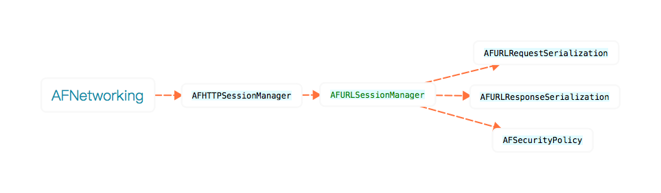

## AFNetworking

结构图

AFNetworking共分为5个模块，分别为NSURLSession请求管理中心、Security安全验证、Serialization请求和响应数据解析、Reachablility网络状态管理、UIKit分类扩展。
AFN之前是基于NSURLConnection，iOS 7.0 之后开始全面支持NSURLSession。

AFNetworking
`头文件，方便引用其它文件。`

AFURLSessionManager
`核心类，基本实现了核心功能。负责请求的建立、管理、销毁、安全、重定向、请求重启等功能。`
`负责实现对NSURLSession和NSURLSessionTask的封装。`

AFHTTPSessionManager
`是AFURLSessionManager的子类，实现对HTTP请求的优化封装，方便使用。`

AFURLRequestSerialization
`对请求头的编码解码、序列化、简化请求拼接过程等。`

AFURLResponseSerialization
`对返回数据的序列化、编码解码、数据处理等。`

AFSecurityPolicy
`用于请求的安全认证。比如https的证书验证。`

AFNetworkReachabilityManager
`用于监听网络状态的变化。`

##### 为什么使用NSURLSession
AFN以前的版本是基于NSURLConnection，随着iOS 7.0NSURLSession的推出，3.0以后完全开始支持NSURLSession。

- NSURLSession是对NSURLConnection的重构优化，支持HTTP 2.0，速度更加快捷，功能更强大、坑少、好用。
- NSURLSession的任务是采用NSOperationQueue管理，NSURLConnection是默认是基于当前创建线程的runLoop来执行委托代理进行请求的回调。
- NSURLSession将普通请求、上传、下载分别对应NSURLSessionDataTask、NSURLSessionUploadTask和NSURLSessionDownloadTask，创建的task都是挂起状态，可以选择性开启。
- 执行上传任务是，NSURLSession和NSURLConnection都需要设置POST请求的请求体来上传。
- 下载任务时，NSURLConnection会将数据先保存到内存，然后转移到沙盒。文件比较大时会出现内存暴增。NSURLSession会直接下载到沙盒tmp临时文件夹下。在下载完成回调方法中需要完成文件的保存，不然下载完成后会删除临时文件。
- NSURLConnection实例化后会直接启动，可以通过cancel停止请求的发送。因为是直接启动，取消只是屏蔽了代理事件的调用。NSURLSession创建后是挂起的，可以通过resume、suspend、cancel来进行管理。
- NSURLConnection采用的是在RunLoop，NSURLSession采用的是NSOperationQueue操作队列。
- 断点下载NSURLSession使用更加便捷
	NSURLConnection通过对HTTPHeaderField的Range属性进行设置，开启运行循环，NSURLConnection的代理方法作为运行循环的事件源，接收到下载数据是代理方法就会持续调用，并使用NSOutputStream管道流进行数据保存。
	NSURLSession进行断点下载，当暂停下载任务后，如果downloadTask为非空，调用cancelByProducingResumeData:(void(^)(NSData *resumeData))completionHandler这个方法，这个方法接收一个参数，完成处理代码块。这个代码块有一个参数resumeData,如果非空则暂存这个数据对象，再次下载是，通过调用[[self.session downloadTaskWithResumeData:self.resumeData] resume]。
- NSURLSession可以设置配置信息，NSURLConnection不能。

三种配置信息：

+ (NSURLSessionConfiguration *)defaultSessionConfiguration
// 配置信息使用基于硬盘的持久话Cache，保存用户的证书到钥匙串,使用共享cookie存储；
	
+ (NSURLSessionConfiguration *)ephemeralSessionConfiguration 
//配置信息和default大致相同。除了，不会把cache，证书，或者任何和Session相关的数据存储到硬盘，而是存储在内存中，生命周期和Session一致。比如浏览器无痕浏览等功能就可以基于这个来做；
	
+ (NSURLSessionConfiguration *)backgroundSessionConfigurationWithIdentifier:(NSString *)identifier
//配置信息可以创建一个可以在后台甚至APP已经关闭的时候仍然在传输数据的session。注意，后台Session一定要在创建的时候赋予一个唯一的identifier，这样在APP下次运行的时候，能够根据identifier来进行相关的区分。
如果用户关闭了APP,IOS 系统会关闭所有的background Session。而且，被用户强制关闭了以后，IOS系统不会主动唤醒APP，只有用户下次启动了APP，数据传输才会继续。 

##### 为什么尽量共享session

HTTP 1.1 中新增一个Connection:keep-alive的保活选项，这个选项会让TCP连接保持一段时间不被断开。
共享的Session可以提供TCP通道的复用，减少同一服务器之间网络连接三次握手的次数，提高网络请求的时间。
