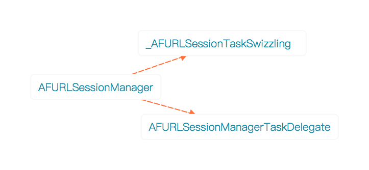
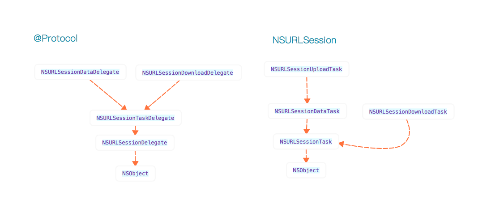

## AFURLSessionManager

结构



#### static方法

以static和dispatch_once的方式创建了一个串行队列、一个并行队列、一个dispatch_group。

其中串行队列用于处理在Foundation库版本比较低时的block处理：

```
//Foundation的版本低于NSFoundationVersionNumber_With_Fixed_5871104061079552_bug，则在串行队列中执行 block
//否则直接执行
static void url_session_manager_create_task_safely(dispatch_block_t block) {
    
    if (NSFoundationVersionNumber < NSFoundationVersionNumber_With_Fixed_5871104061079552_bug) {
        // Fix of bug
        // Open Radar:http://openradar.appspot.com/radar?id=5871104061079552 (status: Fixed in iOS8)
        // Issue about:https://github.com/AFNetworking/AFNetworking/issues/2093
        dispatch_sync(url_session_manager_creation_queue(), block);
    } else {
        block();
    }
}
```

#### 去警告：

	#pragma GCC diagnostic push
	#pragma GCC diagnostic ignored "-Wnonnull"
	       //some warning code
	#pragma clang diagnostic pop


#### 基本属性：

```
@property (readonly, nonatomic, strong) NSURLSession *session;
AFURLSessionManager管理这一个基于NSURLSessionConfiguration对象创建的NSURLSession对象。AFURLSessionManager遵守着6个协议，分别是

NSURLSessionDelegate、NSURLSessionTaskDelegate、NSURLSessionDataDelegate、NSURLSessionDownloadDelegate、NSSecureCoding、NSCopying协议

@property (readonly, nonatomic, strong) NSOperationQueue *operationQueue;
每个任务会绑定一个delegate对象，这些对象会被添加到这个操作队列中。

@property (nonatomic, strong) id <AFURLResponseSerialization> responseSerializer;//不可为空
使用GET、POST方式调用`dataTaskWithRequest:success:failure:`从data tasks中返回的服务器数据。会使用这个对象进行验证和序列化。这个对象不可为空。

@property (nonatomic, strong) AFSecurityPolicy *securityPolicy;
安全策略，用于安全连接上检测服务器的是否信任，默认采用defaultPolicy策略。

@property (readwrite, nonatomic, strong) AFNetworkReachabilityManager *reachabilityManager;
监听网路状态变化，阻止或暂停将要发送的请求。
```

#### 任务集属性：

```
//上传任务集合
@property (readonly, nonatomic, strong) NSArray <NSURLSessionUploadTask *> *uploadTasks;

//下载任务集合
@property (readonly, nonatomic, strong) NSArray <NSURLSessionDownloadTask *> *downloadTasks;

//数据任务
@property (readonly, nonatomic, strong) NSArray <NSURLSessionDataTask *> *dataTasks;

//包含data、upload、download任务的集合
@property (readonly, nonatomic, strong) NSArray <NSURLSessionTask *> *tasks;
```

#### 回调队列属性：

```
//请求完成后的回调队列，没有设置则默认在Main queue中回调
@property (nonatomic, strong, nullable) dispatch_queue_t completionQueue;

//一个用于请求完成后回调的group，没有设置则使用一个私有的的group
@property (nonatomic, strong, nullable) dispatch_group_t completionGroup;
```

#### 系统异常处理：

```
//在ios 7.0中有一个bug，在后台session上创建上传任务时有时返回的是nil。通过设置该属性来判断是否需要进行请求重建。
@property (nonatomic, assign) BOOL attemptsToRecreateUploadTasksForBackgroundSessions;
```

#### 协议和任务类型的继承关系



#### URLSessionManager的创建

基本配置
```
//session配置
if (!configuration) {
    configuration = [NSURLSessionConfiguration defaultSessionConfiguration];
}
self.sessionConfiguration = configuration;

//操作队列，默认最大并发数为1，相当于串行队列
self.operationQueue = [[NSOperationQueue alloc] init];
self.operationQueue.maxConcurrentOperationCount = 1;

//session创建
self.session = [NSURLSession sessionWithConfiguration:self.sessionConfiguration delegate:self delegateQueue:self.operationQueue];

//默认JSON方式解析
self.responseSerializer = [AFJSONResponseSerializer serializer];

//默认策略是不校验
self.securityPolicy = [AFSecurityPolicy defaultPolicy];
```

task的delegate集合，以task的identifier为key，AFURLSessionManagerTaskDelegate对象为value
```
self.mutableTaskDelegatesKeyedByTaskIdentifier = [[NSMutableDictionary alloc] init];
    
//保证mutableTaskDelegatesKeyedByTaskIdentifier访问的线程安全
self.lock = [[NSLock alloc] init];
self.lock.name = AFURLSessionManagerLockName;
```

为session创建的任务创建delegate对象并绑定
```
[self.session getTasksWithCompletionHandler:^(NSArray *dataTasks, NSArray *uploadTasks, NSArray *downloadTasks) {
        for (NSURLSessionDataTask *task in dataTasks) {
            [self addDelegateForDataTask:task uploadProgress:nil downloadProgress:nil completionHandler:nil];
        }
        for (NSURLSessionUploadTask *uploadTask in uploadTasks) {
            [self addDelegateForUploadTask:uploadTask progress:nil completionHandler:nil];
        }
        for (NSURLSessionDownloadTask *downloadTask in downloadTasks) {
            [self addDelegateForDownloadTask:downloadTask progress:nil destination:nil completionHandler:nil];
        }
    }];
```

#### 任务与delegate的绑定

以NSLock锁来保证字典数据访问的线程安全。

以task.taskIdentifier来作为字典的key。将self的指针赋值给taskIdentifer。

以绑定的AFURLSessionManagerTaskDelegate代理作为value。

`绑定：`
- 创建AFURLSessionManagerTaskDelegate，设置manager和completionHandler。
- 对于downloadTask，需要为delegate设置临时文件转移地址
- 加锁
- 在字典mutableTaskDelegatesKeyedByTaskIdentifier中保存taskIdentifer和delegate
- 设置delegate与task的绑定、task和progress的KVO、代理方法的回调
- 为task注册启动和暂停的通知
- 解锁
- 选择性替换自定义的progress

`解绑：`
- 根据taskIdentifer获取delegate
- 加锁
- 销毁delegate的KVO注册
- 销毁task注册的通知
- 从mutableTaskDelegatesKeyedByTaskIdentifier中移除该映射关系
- 解锁

综合起来就是如下：

```
AFURLSessionManagerTaskDelegate *delegate = [[AFURLSessionManagerTaskDelegate alloc] init];
    delegate.manager = self;
    delegate.completionHandler = completionHandler;
    
    //返回临时文件转移地址
    if (destination) {
        delegate.downloadTaskDidFinishDownloading = ^NSURL * (NSURLSession * __unused session, NSURLSessionDownloadTask *task, NSURL *location) {
            return destination(location, task.response);
        };
    }
    
    dataTask.taskDescription = self.taskDescriptionForSessionTasks;
    
    [self.lock lock];
    //保存delegate与task的映射
    self.mutableTaskDelegatesKeyedByTaskIdentifier[@(dataTask.taskIdentifier)] = delegate;
    //设置delegate与task的绑定
    [delegate setupProgressForTask:dataTask];
    //为task添加启动和暂停的通知
    [self addNotificationObserverForTask:dataTask];
    [self.lock unlock];
    
    //替换成自己的progress
    delegate.uploadProgressBlock = uploadProgressBlock;
    delegate.downloadProgressBlock = downloadProgressBlock;
```

#### 获取对应的task集合

为属性生成getter方法，调用获取方法时通过传入方法名。利用NSURLSession的任务枚举方法获取对应的任务集合。

通过dispatch_semaphore_t信号量机制保证获取任务时的线程安全。

NSStringFromSelector(_cmd)可以获取方法名。
```
- (NSArray *)dataTasks {
    return [self tasksForKeyPath:NSStringFromSelector(_cmd)];
}
```
	
核心方法
```
- (NSArray *)tasksForKeyPath:(NSString *)keyPath {
    __block NSArray *tasks = nil;
    dispatch_semaphore_t semaphore = dispatch_semaphore_create(0);
    
    [self.session getTasksWithCompletionHandler:^(NSArray *dataTasks, NSArray *uploadTasks, NSArray *downloadTasks) {
        
        if ([keyPath isEqualToString:NSStringFromSelector(@selector(dataTasks))]) {
            tasks = dataTasks;
        } else if ([keyPath isEqualToString:NSStringFromSelector(@selector(uploadTasks))]) {
            tasks = uploadTasks;
        } else if ([keyPath isEqualToString:NSStringFromSelector(@selector(downloadTasks))]) {
            tasks = downloadTasks;
        } else if ([keyPath isEqualToString:NSStringFromSelector(@selector(tasks))]) {
            tasks = [@[dataTasks, uploadTasks, downloadTasks] valueForKeyPath:@"@unionOfArrays.self"];
        }

        dispatch_semaphore_signal(semaphore);
    }];

    dispatch_semaphore_wait(semaphore, DISPATCH_TIME_FOREVER);

    return tasks;
}
```

#### 取消session
```
- (void)invalidateSessionCancelingTasks:(BOOL)cancelPendingTasks {
    dispatch_async(dispatch_get_main_queue(), ^{
        if (cancelPendingTasks) {
            //直接取消执行的任务，并销毁session，还未执行的任务直接取消掉
            [self.session invalidateAndCancel];
        } else {
            //在完成剩余的任务后再销毁session
            [self.session finishTasksAndInvalidate];
        }
    });
}
```

#### 任务创建

##### 各任务的创建方式
创建dataTask
```
- (NSURLSessionDataTask *)dataTaskWithRequest:(NSURLRequest *)request;
- (NSURLSessionDataTask *)dataTaskWithURL:(NSURL *)url;
```

创建uploadTask
```
- (NSURLSessionUploadTask *)uploadTaskWithRequest:(NSURLRequest *)request fromFile:(NSURL *)fileURL;
- (NSURLSessionUploadTask *)uploadTaskWithRequest:(NSURLRequest *)request fromData:(NSData *)bodyData;
- (NSURLSessionUploadTask *)uploadTaskWithStreamedRequest:(NSURLRequest *)request;
```

创建downloadTask
```
- (NSURLSessionDownloadTask *)downloadTaskWithRequest:(NSURLRequest *)request;
- (NSURLSessionDownloadTask *)downloadTaskWithURL:(NSURL *)url;
- (NSURLSessionDownloadTask *)downloadTaskWithResumeData:(NSData *)resumeData;

```
##### 步骤

通过`url_session_manager_create_task_safely`安全创建对应任务

通过`addDelegateForUploadTask: progress: completionHandler:`、
`addDelegateForDataTask: uploadProgress: downloadProgress: completionHandler:`、
`addDelegateForDataTask: uploadProgress: downloadProgress: completionHandler:`
为任务添加delegate

##### 注意点

- 通过fileURL上传在iOS 7.0中，根据FileURL创建有时会失败，这里有个重试机制可以通过属性设置开启。
`@property (nonatomic, assign) BOOL attemptsToRecreateUploadTasksForBackgroundSessions;`

代码如下：
```
//创建 upload task
    __block NSURLSessionUploadTask *uploadTask = nil;
    url_session_manager_create_task_safely(^{
        uploadTask = [self.session uploadTaskWithRequest:request fromFile:fileURL];
    });
    
//尝试多次创建，直到尝试次数达到3次或创建成功
    if (!uploadTask && self.attemptsToRecreateUploadTasksForBackgroundSessions && self.session.configuration.identifier) {
        for (NSUInteger attempts = 0; !uploadTask && attempts < AFMaximumNumberOfAttemptsToRecreateBackgroundSessionUploadTask; attempts++) {
            uploadTask = [self.session uploadTaskWithRequest:request fromFile:fileURL];
        }
    }
```

#### 授权验证

分为`Session授权挑战`和`dataTask授权挑战`

```
-----NSURLSessionDelegate
- (void)URLSession:(NSURLSession *)session
didReceiveChallenge:(NSURLAuthenticationChallenge *)challenge
 completionHandler:(void (^)(NSURLSessionAuthChallengeDisposition disposition, NSURLCredential *credential))completionHandler
 
-----NSURLSessionTaskDelegate
- (void)URLSession:(NSURLSession *)session
              task:(NSURLSessionTask *)task
didReceiveChallenge:(NSURLAuthenticationChallenge *)challenge
 completionHandler:(void (^)(NSURLSessionAuthChallengeDisposition disposition, NSURLCredential *credential))completionHandler
```

验证过程
```
 //默认配置
    NSURLSessionAuthChallengeDisposition disposition = NSURLSessionAuthChallengePerformDefaultHandling;
    __block NSURLCredential *credential = nil;
    
    if (self.sessionDidReceiveAuthenticationChallenge) {
        //使用自定义的挑战方式
        self.sessionDidReceiveAuthenticationChallenge(session, challenge, &credential);
    }else{
        //服务器身份验证
        if ([challenge.protectionSpace.authenticationMethod isEqualToString:NSURLAuthenticationMethodServerTrust]) {
            //使用securityPolicy进行验证，默认使用[AFSecurityPolicy defaultPolicy]策略进行验证
            if ([self.securityPolicy evaluateServerTrust:challenge.protectionSpace.serverTrust forDomain:challenge.protectionSpace.host]) {
                //创建证书，成功创建则修改disposition为NSURLSessionAuthChallengeUseCredential
                credential = [NSURLCredential credentialForTrust:challenge.protectionSpace.serverTrust];
                if (credential) {
                    disposition = NSURLSessionAuthChallengeUseCredential;
                }
            }else{
                //验证未通过
                disposition = NSURLSessionAuthChallengeCancelAuthenticationChallenge;
            }
        }
    }
    if (completionHandler) {
        completionHandler(disposition, credential);
    }

```

#### dataTask变成下载任务

执行delegate的解绑与重新绑定
```
- (void)URLSession:(NSURLSession *)session
          dataTask:(NSURLSessionDataTask *)dataTask
didBecomeDownloadTask:(NSURLSessionDownloadTask *)downloadTask
{
    //获取dataTask的代理
    AFURLSessionManagerTaskDelegate *delegate = [self delegateForTask:dataTask];
    
    if (delegate) {
        //将该delegate与dataTask解绑
        [self removeDelegateForTask:dataTask];
        //将delegate与新的downloadTask重新绑定
        [self setDelegate:delegate forTask:downloadTask];
    }

    if (self.dataTaskDidBecomeDownloadTask) {
        self.dataTaskDidBecomeDownloadTask(session, dataTask, downloadTask);
    }
}
```

#### 下载完成处理

NSURLSessionDownloadDelegate中对下载的文件处理有两步
- 尝试使用session的公共地址去转移下载的临时文件，并将代理的文件地址覆盖成该地址。成功则结束。
- 尝试使用delegate去尝试保存临时文件

```
- (void)URLSession:(NSURLSession *)session
      downloadTask:(NSURLSessionDownloadTask *)downloadTask
didFinishDownloadingToURL:(NSURL *)location
{
    AFURLSessionManagerTaskDelegate *delegate = [self delegateForTask:downloadTask];
    //尝试使用session的公共地址去转移下载的临时文件
    if (self.downloadTaskDidFinishDownloading) {
        NSURL *fileURL = self.downloadTaskDidFinishDownloading(session, downloadTask, location);
        if (fileURL) {
            
            //公共地址存在则将代理的文件地址覆盖成该地址
            delegate.downloadFileURL = fileURL;
            
            NSError *error = nil;
            [[NSFileManager defaultManager] moveItemAtURL:location toURL:fileURL error:&error];
            if (error) {
                [[NSNotificationCenter defaultCenter] postNotificationName:AFURLSessionDownloadTaskDidFailToMoveFileNotification object:downloadTask userInfo:error.userInfo];
            }
            return;
        }
    }
    
    //没有公共的转移地址则使用delegate去尝试保存临时文件
    if (delegate) {
        [delegate URLSession:session downloadTask:downloadTask didFinishDownloadingToURL:location];
    }
}
```

#### 验证方法

重写覆盖
将对应block的存在作为判断方法的标准
```
- (BOOL)respondsToSelector:(SEL)selector {
    if (selector == @selector(URLSession:task:willPerformHTTPRedirection:newRequest:completionHandler:)) {
        return self.taskWillPerformHTTPRedirection != nil;
    } else if (selector == @selector(URLSession:dataTask:didReceiveResponse:completionHandler:)) {
        return self.dataTaskDidReceiveResponse != nil;
    } else if (selector == @selector(URLSession:dataTask:willCacheResponse:completionHandler:)) {
        return self.dataTaskWillCacheResponse != nil;
    } else if (selector == @selector(URLSessionDidFinishEventsForBackgroundURLSession:)) {
        return self.didFinishEventsForBackgroundURLSession != nil;
    }

    return [[self class] instancesRespondToSelector:selector];
}
```

