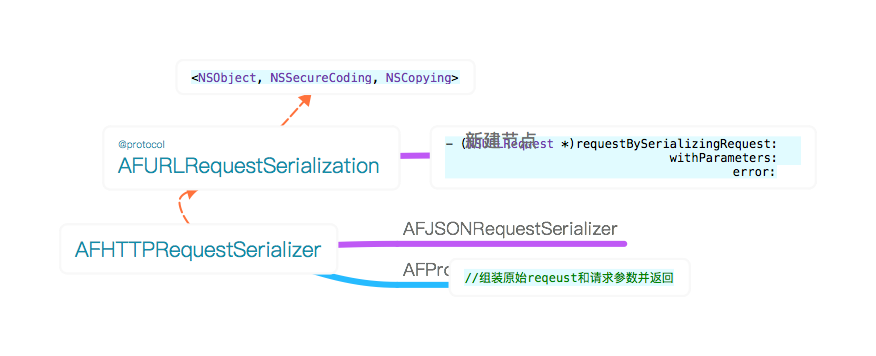
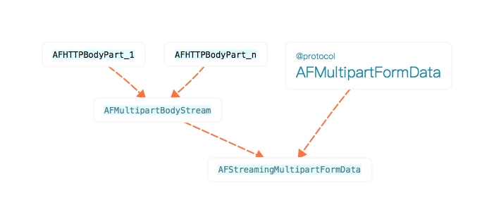

## AFHTTPRequestSerializer

### AFJSONRequestSerializer

- 使用NSJSONSerialization对参数进行JSON编码
- 设置Content-Type:application/json

```
	- (NSURLRequest *)requestBySerializingRequest:(NSURLRequest *)request
	                               withParameters:(id)parameters
	                                        error:(NSError *__autoreleasing *)error
	{
	    NSParameterAssert(request);
	
	    //不是POST请求，不需要JSON化，直接调用父类序列化方法
	    if ([self.HTTPMethodsEncodingParametersInURI containsObject:[[request HTTPMethod] uppercaseString]]) {
	        return [super requestBySerializingRequest:request withParameters:parameters error:error];
	    }
	    
	    NSMutableURLRequest *mutableRequest = [request mutableCopy];
	    
	     //查询默认设置的请求头部选项，reqeust中没有的则添加
	    [self.HTTPRequestHeaders enumerateKeysAndObjectsUsingBlock:^(id field, id value, BOOL * __unused stop) {
	        if (![request valueForHTTPHeaderField:field]) {
	            [mutableRequest setValue:value forHTTPHeaderField:field];
	        }
	    }];
	    
	    //有参数，则需添加进HTTPBody
	    if (parameters) {
	        //没有设置Content-Type，则设置为application/json
	        if (![mutableRequest valueForHTTPHeaderField:@"Content-Type"]) {
	            [mutableRequest setValue:@"application/json" forHTTPHeaderField:@"Content-Type"];
	        }
	        //将JSON化的参数添加进HTTPBody
	        [mutableRequest setHTTPBody:[NSJSONSerialization dataWithJSONObject:parameters options:self.writingOptions error:error]];
	    }
	    return mutableRequest;
	}
```

### AFPropertyListRequestSerializer

- 使用NSPropertyListSerializer对参数进行JSON编码
- 设置Content-Type:application/x-plist

```
	- (NSURLRequest *)requestBySerializingRequest:(NSURLRequest *)request
	                               withParameters:(id)parameters
	                                        error:(NSError *__autoreleasing *)error
	{
	    NSParameterAssert(request);
	
	    //不是POST请求，不需要JSON化，直接调用父类序列化方法
	    if ([self.HTTPMethodsEncodingParametersInURI containsObject:[[request HTTPMethod] uppercaseString]]) {
	        return [super requestBySerializingRequest:request withParameters:parameters error:error];
	    }
	    
	    NSMutableURLRequest *mutableRequest = [request mutableCopy];
	    
	     //查询默认设置的请求头部选项，reqeust中没有的则添加
	    [self.HTTPRequestHeaders enumerateKeysAndObjectsUsingBlock:^(id field, id value, BOOL * __unused stop) {
	        if (![request valueForHTTPHeaderField:field]) {
	            [mutableRequest setValue:value forHTTPHeaderField:field];
	        }
	    }];
	    
	    //有参数，则需添加进HTTPBody
	    if (parameters) {
	        if (![mutableRequest valueForHTTPHeaderField:@"Content-Type"]) {
	            [mutableRequest setValue:@"application/x-plist" forHTTPHeaderField:@"Content-Type"];
	        }
	
	        [mutableRequest setHTTPBody:[NSPropertyListSerialization dataWithPropertyList:parameters format:self.format options:self.writeOptions error:error]];
   		 }
	    return mutableRequest;
	}
```

#### AFJSONRequestSerializer与AFPropertyListRequestSerializer的区别

共同点：
- 当请求方式非GET、HEAD、DELETE时，也就是不需要将参数添加到HTTP body中时，直接使用父类的序列化方式。

不同：
- Content-Type选项不同。
- 参数parameters转换成NSData的序列化方式不同

### AFHTTPRequestSerializer

#### 架构：



#### 是否使用管道技术，在等待服务器的ACK响应式继续发送下一个packet
`@property (nonatomic, assign) BOOL HTTPShouldUsePipelining;`

#### 自定义查询参数序列化block
`- (void)setQueryStringSerializationWithBlock:(nullable NSString * (^)(NSURLRequest *request, id parameters, NSError * __autoreleasing *error))block;`

#### 给HTTP header设置授权用户名和密码

将`username:password`字符串转换成二进制data，然后获取data的base64字符串，最后添加到`Authorization`选项中。
```
- (void)setAuthorizationHeaderFieldWithUsername:(NSString *)username
                                       password:(NSString *)password
{
    NSData *basicAuthCredentials = [[NSString stringWithFormat:@"%@:%@", username, password] dataUsingEncoding:NSUTF8StringEncoding];
    NSString *base64AuthCredentials = [basicAuthCredentials base64EncodedStringWithOptions:(NSDataBase64EncodingOptions)0];
    [self setValue:[NSString stringWithFormat:@"Basic %@", base64AuthCredentials] forHTTPHeaderField:@"Authorization"];
}
```

#### 请求序列化方式

##### 一般请求

	/*
	 一般请求
	 1.根据url创建URLRequest
	 2.设置HTTPMethod
	 3.将通过KVO监听选项值修改的keypaths添加request的HTTP Header
	 4.对reqeust和参数进行序列化拼接
	 */
	
	- (NSMutableURLRequest *)requestWithMethod:(NSString *)method
	                                 URLString:(NSString *)URLString
	                                parameters:(id)parameters
	                                     error:(NSError *__autoreleasing *)error

##### formData请求方式

	/*
	 非GET或HEAD请求
	 1.数据和参数都是放在Request body中，直接调用`- (NSMutableURLRequest *)requestWithMethod: URLString: parameters: error:`创建序列化后的request
	 2.创建AFStreamingMultipartFormData，将参数parameters添加到formData对象中
	 3.执行block，添加附件数据到formData
	 4.初始化AFMultipartBodyStream设置，和设置HTTP Header内容边界信息
	 */
	- (NSMutableURLRequest *)multipartFormRequestWithMethod:(NSString *)method
	                                              URLString:(NSString *)URLString
	                                             parameters:(NSDictionary *)parameters
	                              constructingBodyWithBlock:(void (^)(id <AFMultipartFormData> formData))block
	                                                  error:(NSError *__autoreleasing *)error

##### FileURL请求方式

	/*
	 通过本地文件URL请求的request
	 1.创建inputStream和outputStream
	 2.异步添加I/O流到currentRunLoop的defaultMode中
	 3.开启流...关闭流
	 4.将HTTPBodyStream置nil
	 */
	- (NSMutableURLRequest *)requestWithMultipartFormRequest:(NSURLRequest *)request
	                             writingStreamContentsToFile:(NSURL *)fileURL
	                                       completionHandler:(void (^)(NSError *error))handler

##### 根据扩展名获取Content-Type

	static inline NSString * AFContentTypeForPathExtension(NSString *extension) {
	    
	    NSString *UTI = (__bridge_transfer NSString *)UTTypeCreatePreferredIdentifierForTag(kUTTagClassFilenameExtension, (__bridge CFStringRef)extension, NULL);
	    
	    NSString *contentType = (__bridge_transfer NSString *)UTTypeCopyPreferredTagWithClass((__bridge CFStringRef)UTI, kUTTagClassMIMEType);
	    
	    if (!contentType) {
	        return @"application/octet-stream";
	    } else {
	        return contentType;
	    }
	}

#### AFQueryStringPair
	
保存field和value的对象，提供对field和value的URLEncode转码

字符串URLEncode

	stringByAddingPercentEscapesUsingEncoding已经废弃掉了，它虽然能将汉字转换成Unicode，但对于一些与url冲突的特殊字符却无可奈何。推荐使用stringByAddingPercentEncodingWithAllowedCharacters来设置不用转义的字符串集。
	AFN采用的是对参数字典里的key和value分别编码进行进行拼接，GET请求就拼接到url尾部。POST就添加到HTTP body中。


## AFStreamingMultipartFormData

关系图



####  NSStream ()重写
不明白用意

	@interface NSStream ()
	
	@property (readwrite) NSStreamStatus streamStatus;
	
	@property (readwrite, copy) NSError *streamError;
	
	@end

#### AFHTTPBodyPart : NSObject

- HTTP Body
- HTTP Header
- body长度
- 边界boundary

在主线程中执行

	- (BOOL)transitionToNextPhase {
	    if (![[NSThread currentThread] isMainThread]) {
	        dispatch_sync(dispatch_get_main_queue(), ^{
	            [self transitionToNextPhase];
	        });
	        return YES;
	    }
	    
#### AFMultipartBodyStream : NSInputStream <NSStreamDelegate, NSCopying>

管理着多个AFHTTPBodyPart，每个AFHTTPBodyPart分别对应着一个参数映射或附件数据。

#### @protocol AFMultipartFormData

该协议提供了几组为请求提交附加文件数据的API。同时在HTTP header中设置以下参数：

	Content-Disposition: file/form-data filename=#{generated filename} name=#{name} //服务器接收文件数据的名称
	Content-Type：{mimeType}

还提供了一个节流器API

	//节流设置，限制packet的大小，同时对从文件流中读取每个chunk设置一个延迟
	//不要尝试直接根据网络连接状态来进行throttle设置，因为在NSURLConnection无法具体区分3G, EDGE, or LTE。应该通过在失败回调block中检测错误信息"request body stream exhausted"来重置throttle带宽。
	//默认推荐的packet大小是16kb，默认延迟0.2s
	- (void)throttleBandwidthWithPacketSize:(NSUInteger)numberOfBytes
	                                  delay:(NSTimeInterval)delay;
	                                 
推荐参数：
- FOUNDATION_EXPORT NSUInteger const kAFUploadStream3GSuggestedPacketSize;
- FOUNDATION_EXPORT NSTimeInterval const kAFUploadStream3GSuggestedDelay;

#### AFStreamingMultipartFormData : NSObject <AFMultipartFormData>

将参数和数据以AFHTTPBodyPart对象添加到持有的AFMultipartBodyStream对象中。

通过FileURL添加文件

	- (BOOL)appendPartWithFileURL:(NSURL *)fileURL name:(NSString *)name
	                     fileName:(NSString *)fileName mimeType:(NSString *)mimeType
	                        error:(NSError * __autoreleasing *)error
	{
	  
	    if (![fileURL isFileURL]) {//是否是文件链接
	        return NO;
	    } else if ([fileURL checkResourceIsReachableAndReturnError:error] == NO) {//地址是否访问有效
	        return NO;
	    }
	
	    //文件属性
	    NSDictionary *fileAttributes = [[NSFileManager defaultManager] attributesOfItemAtPath:[fileURL path] error:error];
	    if (!fileAttributes) {
	        return NO;
	    }
	
	    //头部
	    NSMutableDictionary *mutableHeaders = [NSMutableDictionary dictionary];
	    [mutableHeaders setValue:[NSString stringWithFormat:@"form-data; name=\"%@\"; filename=\"%@\"", name, fileName] forKey:@"Content-Disposition"];
	    [mutableHeaders setValue:mimeType forKey:@"Content-Type"];
	    
	    //创建AFHTTPBodyPart
	    AFHTTPBodyPart *bodyPart = [[AFHTTPBodyPart alloc] init];
	    bodyPart.stringEncoding = self.stringEncoding;
	    bodyPart.headers = mutableHeaders;
	    bodyPart.boundary = self.boundary;
	    bodyPart.body = fileURL;
	    bodyPart.bodyContentLength = [fileAttributes[NSFileSize] unsignedLongLongValue];
	    
	    //添加AFHTTPBodyPart到AFMultipartBodyStream
	    [self.bodyStream appendHTTPBodyPart:bodyPart];
	
	    return YES;
	}
	
创建NSMutableURLRequest

	- (NSMutableURLRequest *)requestByFinalizingMultipartFormData {
	    
	    if ([self.bodyStream isEmpty]) {
	        return self.request;
	    }
	
	    // Reset the initial and final boundaries to ensure correct Content-Length
	    [self.bodyStream setInitialAndFinalBoundaries];
	    
	    [self.request setHTTPBodyStream:self.bodyStream];
	
	    [self.request setValue:[NSString stringWithFormat:@"multipart/form-data; boundary=%@", self.boundary] forHTTPHeaderField:@"Content-Type"];
	    [self.request setValue:[NSString stringWithFormat:@"%llu", [self.bodyStream contentLength]] forHTTPHeaderField:@"Content-Length"];
	
	    return self.request;
	}
