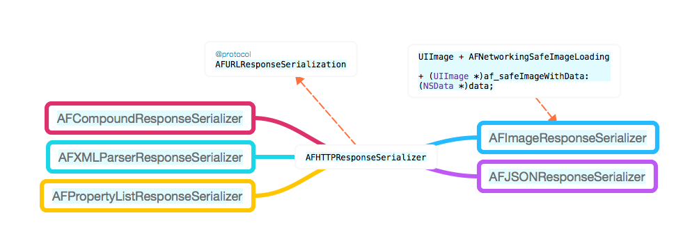

## AFURLResponseSerializer

结构：



- 先定义一个基类AFHTTPResponseSerializer，用来对返回数据进行content-type和statusCode的有效性校验，判断是否为可接受的类型范围。
- 建立继承AFHTTPResponseSerializer子类，分别用于处理各种不同的数据类型，并且设置自身数据类型能处理的content-type集合。
- 其中图片解析子类借助了一个线程安全的category图片数据加载。以及连个static全局函数采用不同方式来创建UIImage对象。
- 最后有一个子类采用集合的形式持有多个解析器来对数据进行解析。
- 基类解析、单类型解析、多方式解析都有所考虑。

### @Protocol AFURLResponseSerialization

解析服务器返回数据。
每个解析对象都会准守AFURLResponseSerialization协议，以自己的方式解析返回的数据。

	- (nullable id)responseObjectForResponse:(nullable NSURLResponse *)response
	                           data:(nullable NSData *)data
	                          error:(NSError * _Nullable __autoreleasing *)error NS_SWIFT_NOTHROW;
	                          

NSURL
NSURLSession
NSURLCache
NSURLProtpcol
NSURLConnection
NSURLCredential
NSURLCredentialStorage
NSURLProtectSpace
NSURLError
NSURLRequest	                          
NSURLResponse
NSHTTPURLResponse

	                         
	
### 基类AFHTTPResponseSerializer

主要作用就是在AFURLResponseSerialization的协议方法中对返回数据进行有效性判断。

- 1.不可接受的Content-Type为无效返回数据
- 2.不可接受的StatusCode为无效数据
- 有限提示StatusCode错误

```
//关键方法
- (BOOL)validateResponse:(NSHTTPURLResponse *)response
                    data:(NSData *)data
                   error:(NSError * __autoreleasing *)error
{
    BOOL responseIsValid = YES;
    NSError *validationError = nil;

    if (response && [response isKindOfClass:[NSHTTPURLResponse class]]) {
        
        //不可接受的Content-Type类型
        if (self.acceptableContentTypes
            && ![self.acceptableContentTypes containsObject:[response MIMEType]]
            && !([response MIMEType] == nil && [data length] == 0)) {

            if ([data length] > 0 && [response URL]) {
                NSMutableDictionary *mutableUserInfo = [@{
                                                          NSLocalizedDescriptionKey: [NSString stringWithFormat:NSLocalizedStringFromTable(@"Request failed: unacceptable content-type: %@", @"AFNetworking", nil), [response MIMEType]],
                                                          NSURLErrorFailingURLErrorKey:[response URL],
                                                          AFNetworkingOperationFailingURLResponseErrorKey: response,
                                                        } mutableCopy];
                if (data) {
                    mutableUserInfo[AFNetworkingOperationFailingURLResponseDataErrorKey] = data;
                }

                validationError = AFErrorWithUnderlyingError([NSError errorWithDomain:AFURLResponseSerializationErrorDomain code:NSURLErrorCannotDecodeContentData userInfo:mutableUserInfo], validationError);
            }

            responseIsValid = NO;
        }

        //返回状态妈statusCode不在接受范围
        if (self.acceptableStatusCodes && ![self.acceptableStatusCodes containsIndex:(NSUInteger)response.statusCode] && [response URL]) {
            NSMutableDictionary *mutableUserInfo = [@{
                                               NSLocalizedDescriptionKey: [NSString stringWithFormat:NSLocalizedStringFromTable(@"Request failed: %@ (%ld)", @"AFNetworking", nil), [NSHTTPURLResponse localizedStringForStatusCode:response.statusCode], (long)response.statusCode],
                                               NSURLErrorFailingURLErrorKey:[response URL],
                                               AFNetworkingOperationFailingURLResponseErrorKey: response,
                                       } mutableCopy];

            if (data) {
                mutableUserInfo[AFNetworkingOperationFailingURLResponseDataErrorKey] = data;
            }

            validationError = AFErrorWithUnderlyingError([NSError errorWithDomain:AFURLResponseSerializationErrorDomain code:NSURLErrorBadServerResponse userInfo:mutableUserInfo], validationError);

            responseIsValid = NO;
        }
    }

    
    if (error && !responseIsValid) {
        *error = validationError;
    }

    return responseIsValid;
}
```

### AFJSONResponseSerializer

解析JSON数据
Content-Type设置：
	
	[NSSet setWithObjects:@"application/json", @"text/json", @"text/javascript", nil];

```
- (id)responseObjectForResponse:(NSURLResponse *)response
                           data:(NSData *)data
                          error:(NSError *__autoreleasing *)error
{
    //数据是否无效
    if (![self validateResponse:(NSHTTPURLResponse *)response data:data error:error]) {
        //不需要返回错误，或返回错误类型符合NSURLErrorCannotDecodeContentData，则返回空数据
        if (!error || AFErrorOrUnderlyingErrorHasCodeInDomain(*error, NSURLErrorCannotDecodeContentData, AFURLResponseSerializationErrorDomain)) {
            return nil;
        }
    }

    id responseObject = nil;
    NSError *serializationError = nil;
    
    //数据长度不为0，且不为空白数据，则用NSJSONSerialization进行解析
    BOOL isSpace = [data isEqualToData:[NSData dataWithBytes:" " length:1]];
    if (data.length > 0 && !isSpace) {
        responseObject = [NSJSONSerialization JSONObjectWithData:data options:self.readingOptions error:&serializationError];
    } else {
        return nil;
    }

    //移除数据中空字段
    if (self.removesKeysWithNullValues && responseObject) {
        responseObject = AFJSONObjectByRemovingKeysWithNullValues(responseObject, self.readingOptions);
    }
    //有错误则返回
    if (error) {
        *error = AFErrorWithUnderlyingError(serializationError, *error);
    }

    return responseObject;
}
```

### 基类AFXMLParserResponseSerializer

解析XML数据
Content-Type设置：

	[[NSSet alloc] initWithObjects:@"application/xml", @"text/xml", nil];

```	
- (id)responseObjectForResponse:(NSHTTPURLResponse *)response
                           data:(NSData *)data
                          error:(NSError *__autoreleasing *)error
{
    //数据是否无效
    if (![self validateResponse:(NSHTTPURLResponse *)response data:data error:error]) {
        //不需要返回错误，或返回错误类型符合NSURLErrorCannotDecodeContentData，则返回空数据
        if (!error || AFErrorOrUnderlyingErrorHasCodeInDomain(*error, NSURLErrorCannotDecodeContentData, AFURLResponseSerializationErrorDomain)) {
            return nil;
        }
    }
    
    //XML解析
    return [[NSXMLParser alloc] initWithData:data];
}
```

### AFXMLDocumentResponseSerializer

解析XML文档
Content-Type设置：

	[[NSSet alloc] initWithObjects:@"application/xml", @"text/xml", nil];
	
```
- (id)responseObjectForResponse:(NSURLResponse *)response
                           data:(NSData *)data
                          error:(NSError *__autoreleasing *)error
{
    //数据是否无效
    if (![self validateResponse:(NSHTTPURLResponse *)response data:data error:error]) {
        //不需要返回错误，或返回错误类型符合NSURLErrorCannotDecodeContentData，则返回空数据
        if (!error || AFErrorOrUnderlyingErrorHasCodeInDomain(*error, NSURLErrorCannotDecodeContentData, AFURLResponseSerializationErrorDomain)) {
            return nil;
        }
    }

    NSError *serializationError = nil;
    NSXMLDocument *document = [[NSXMLDocument alloc] initWithData:data options:self.options error:&serializationError];

    //数据无效，则将文档解析的错误作为错误返回信息
    if (error) {
        *error = AFErrorWithUnderlyingError(serializationError, *error);
    }

    return document;
}

```


### AFPropertyListResponseSerializer

解析PropertyList
Content-Type设置：

	[[NSSet alloc] initWithObjects:@"application/x-plist", nil];
	
```
- (id)responseObjectForResponse:(NSURLResponse *)response
                           data:(NSData *)data
                          error:(NSError *__autoreleasing *)error
{
    //数据是否无效
    if (![self validateResponse:(NSHTTPURLResponse *)response data:data error:error]) {
        //不需要返回错误，或返回错误类型符合NSURLErrorCannotDecodeContentData，则返回空数据
        if (!error || AFErrorOrUnderlyingErrorHasCodeInDomain(*error, NSURLErrorCannotDecodeContentData, AFURLResponseSerializationErrorDomain)) {
            return nil;
        }
    }

    id responseObject;
    NSError *serializationError = nil;
    //必须要有数据采取解析
    if (data) {
        responseObject = [NSPropertyListSerialization propertyListWithData:data options:self.readOptions format:NULL error:&serializationError];
    }

    //数据无效，则将解析的错误作为错误返回信息
    if (error) {
        *error = AFErrorWithUnderlyingError(serializationError, *error);
    }

    return responseObject;
}
```

### AFImageResponseSerializer

解析图片数据
Content-Type设置

	[[NSSet alloc] initWithObjects:@"image/tiff",	                     @"image/jpeg",								@"image/gif",
		                 @"image/png",
		                  @"image/ico",
		                   @"image/x-icon",
		                    @"image/bmp",
		                      @"image/x-bmp",
		                        @"image/x-xbitmap",
		                          @"image/x-win-bitmap", nil];
		                                                               
imageScale设置：

	self.imageScale = [[UIScreen mainScreen] scale];
	
默认采用自动inflate返回图片：
	
	self.automaticallyInflatesResponseImage = YES;
	
	
```
- (id)responseObjectForResponse:(NSURLResponse *)response
                           data:(NSData *)data
                          error:(NSError *__autoreleasing *)error
{
    //数据是否无效
    if (![self validateResponse:(NSHTTPURLResponse *)response data:data error:error]) {
        //不需要返回错误，或返回错误类型符合NSURLErrorCannotDecodeContentData，则返回空数据
        if (!error || AFErrorOrUnderlyingErrorHasCodeInDomain(*error, NSURLErrorCannotDecodeContentData, AFURLResponseSerializationErrorDomain)) {
            return nil;
        }
    }
    
    if (self.automaticallyInflatesResponseImage) {
        //从返回的response中取获取图片
        return AFInflatedImageFromResponseWithDataAtScale((NSHTTPURLResponse *)response, data, self.imageScale);
    } else {
        //从返回的data数据中获取图片
        return AFImageWithDataAtScale(data, self.imageScale);
    }

```

#### UIImage+AFNetworkingSafeImageLoading

使用static全局静态变量让UIImage类对象持有

	static NSLock* imageLock = nil;

使用dispatch_oncelan初始化imageLock，保证只执行一次，实现懒加载。

	static dispatch_once_t onceToken;
    dispatch_once(&onceToken, ^{
        imageLock = [[NSLock alloc] init];
    });

类方法是在单例类里调用，数据访问需要保证线程安全

	[imageLock lock];
	image = [UIImage imageWithData:data];
	[imageLock unlock];


#### static图片创建方式

以二进制data和设置scale创建图片

```
static UIImage * AFImageWithDataAtScale(NSData *data, CGFloat scale) {
    
    //以data数据线程安全创建图片
    UIImage *image = [UIImage af_safeImageWithData:data];
    //动态图直接返回
    if (image.images) {
        return image;
    }
    //根据设备的scale重新创建图片
    return [[UIImage alloc] initWithCGImage:[image CGImage] scale:scale orientation:image.imageOrientation];
}
```

以response、data、scale创建图片

```
static UIImage * AFInflatedImageFromResponseWithDataAtScale(NSHTTPURLResponse *response, NSData *data, CGFloat scale) {
    
    //图片数据为空，则直接返回nil
    if (!data || [data length] == 0) {
        return nil;
    }

    //穿甲png或jpeg图片
    CGImageRef imageRef = NULL;
    CGDataProviderRef dataProvider = CGDataProviderCreateWithCFData((__bridge CFDataRef)data);
    if ([response.MIMEType isEqualToString:@"image/png"]) {
        imageRef = CGImageCreateWithPNGDataProvider(dataProvider,  NULL, true, kCGRenderingIntentDefault);
    } else if ([response.MIMEType isEqualToString:@"image/jpeg"]) {
        imageRef = CGImageCreateWithJPEGDataProvider(dataProvider, NULL, true, kCGRenderingIntentDefault);

        if (imageRef) {
            CGColorSpaceRef imageColorSpace = CGImageGetColorSpace(imageRef);
            CGColorSpaceModel imageColorSpaceModel = CGColorSpaceGetModel(imageColorSpace);

            // CGImageCreateWithJPEGDataProvider does not properly handle CMKY, so fall back to AFImageWithDataAtScale
            //格式冲突则直接回滚，使用AFImageWithDataAtScale方式创建图片
            if (imageColorSpaceModel == kCGColorSpaceModelCMYK) {
                CGImageRelease(imageRef);
                imageRef = NULL;
            }
        }
    }
    CGDataProviderRelease(dataProvider);

    //普通方式创建
    UIImage *image = AFImageWithDataAtScale(data, scale);
    if (!imageRef) {
        //gif图片直接返回
        if (image.images || !image) {
            return image;
        }

        imageRef = CGImageCreateCopy([image CGImage]);
        if (!imageRef) {
            return nil;
        }
    }

    size_t width = CGImageGetWidth(imageRef);
    size_t height = CGImageGetHeight(imageRef);
    size_t bitsPerComponent = CGImageGetBitsPerComponent(imageRef);

    //图片占用内存太大，直接返回
    if (width * height > 1024 * 1024 || bitsPerComponent > 8) {
        CGImageRelease(imageRef);
        
        return image;
    }

    // CGImageGetBytesPerRow() calculates incorrectly in iOS 5.0, so defer to CGBitmapContextCreate
    size_t bytesPerRow = 0;
    CGColorSpaceRef colorSpace = CGColorSpaceCreateDeviceRGB();
    CGColorSpaceModel colorSpaceModel = CGColorSpaceGetModel(colorSpace);
    CGBitmapInfo bitmapInfo = CGImageGetBitmapInfo(imageRef);

    if (colorSpaceModel == kCGColorSpaceModelRGB) {
        uint32_t alpha = (bitmapInfo & kCGBitmapAlphaInfoMask);
#pragma clang diagnostic push
#pragma clang diagnostic ignored "-Wassign-enum"
        if (alpha == kCGImageAlphaNone) {
            bitmapInfo &= ~kCGBitmapAlphaInfoMask;
            bitmapInfo |= kCGImageAlphaNoneSkipFirst;
        } else if (!(alpha == kCGImageAlphaNoneSkipFirst || alpha == kCGImageAlphaNoneSkipLast)) {
            bitmapInfo &= ~kCGBitmapAlphaInfoMask;
            bitmapInfo |= kCGImageAlphaPremultipliedFirst;
        }
#pragma clang diagnostic pop
    }

    CGContextRef context = CGBitmapContextCreate(NULL, width, height, bitsPerComponent, bytesPerRow, colorSpace, bitmapInfo);

    CGColorSpaceRelease(colorSpace);

    //位图环境创建失败
    if (!context) {
        CGImageRelease(imageRef);

        return image;
    }

    CGContextDrawImage(context, CGRectMake(0.0f, 0.0f, width, height), imageRef);
    CGImageRef inflatedImageRef = CGBitmapContextCreateImage(context);
    CGContextRelease(context);

    //图片位图信息生成的图片
    UIImage *inflatedImage = [[UIImage alloc] initWithCGImage:inflatedImageRef scale:scale orientation:image.imageOrientation];

    CGImageRelease(inflatedImageRef);
    CGImageRelease(imageRef);

    return inflatedImage;
}
```

### AFCompoundResponseSerializer

混合解析器，自身只有一个解析器集合，轮流来对数据进行解析。

	@property (readwrite, nonatomic, copy) NSArray *responseSerializers;


```
- (id)responseObjectForResponse:(NSURLResponse *)response
                           data:(NSData *)data
                          error:(NSError *__autoreleasing *)error
{
    //轮流尝试使用解析器解析，成功则返回数据，解析结束
    for (id <AFURLResponseSerialization> serializer in self.responseSerializers) {
        if (![serializer isKindOfClass:[AFHTTPResponseSerializer class]]) {
            continue;
        }

        NSError *serializerError = nil;
        id responseObject = [serializer responseObjectForResponse:response data:data error:&serializerError];
        if (responseObject) {
            if (error) {
                *error = AFErrorWithUnderlyingError(serializerError, *error);
            }

            return responseObject;
        }
    }

    //解析器都不匹配，则使用父类AFHTTPResponseSerializer解析
    return [super responseObjectForResponse:response data:data error:error];
}
```
