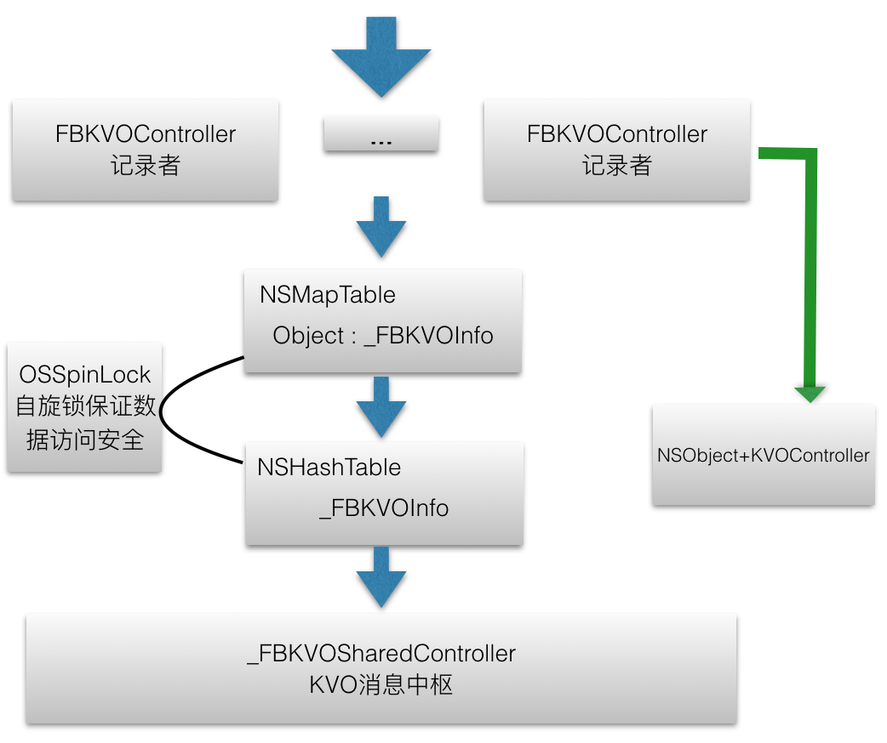

## FBKVOController

###KVO

KVO可以用来监听对象属性的变化、快速做出响应，能为开发强交互、响应式、视图和模型的双向绑定提供大量的帮助。

- 当被观察者销毁时没有移除观察者会导致崩溃。当被观察者被持有时，由持有者去移除。否则需要被观察者自己dealloc时主动移除。
- 没有设置context，多次移除同一观察者会导致崩溃。

####架构图

原理：

	1.object创建FBKVOController并strong持有，同时KVOController对象weak持有self。
	2.然后向FBKVOController添加观察keyPaths和响应动作，这个动作可以是block或selector、context。
	3.向_FBKVOSharedController中注册并监听KVO，它起到消息转发中枢的角色。
	4.FBKVOController监听到key值改变时进行消息转发，执行block、action或perform、KVO通知。
	5.移除KVO监听时，会先移除FBKVOController中mapTable中的obect和KVOInfo对象的映射，然后移除FBKVOSharedController中的KVOInfo对象记录，最后销毁KVO监听。
	6.当对象销毁时持有的FBKVOController也会销毁，调用dealloc移除该KVOController中注册的所以观察对象、消息中心中的KVOInfo记录、KVO监听。
	7.由于NSMapTable、NSHashTable不是线程安全的，采用OSSpinLock自旋锁保证集合对象访问的数据安全。

### _FBKVOInfo

作用：

	用于保存每个被观察keyPath的相关信息。

1.公开实例变量

	@public
	  __weak FBKVOController *_controller;
	  NSString *_keyPath;
	  NSKeyValueObservingOptions _options;
	  SEL _action;
	  void *_context;
	  FBKVONotificationBlock _block;

2.等同性判断（ 为了NSHashTable集合中的对象唯一性 ）

	- (NSUInteger)hash{
	  return [_keyPath hash];//keypath的hash值相同即为同一对象
	}

	- (BOOL)isEqual:(id)object
	{
	  
	  if (nil == object) {
	    return NO;
	  }
	  if (![object isKindOfClass:[self class]]) {
	    return NO;
	  }
	  if (self == object) {//同一实例
	    return YES;
	  }
	  
	  //两个实例的keyPath值相同
	  return [_keyPath isEqualToString:((_FBKVOInfo *)object)->_keyPath];
	}

### _FBKVOSharedController

作用：

	监听消息得接受者，用于接收和转发KVO通知。
	多个KVOController监听的对象keyPath太多，需要一个全局的唯一入口来进行消息接收和转发管理。

只有四个API和一个KVO观察接收消息方法：

	初始化
	+ (instancetype)sharedController;
		一个NSHashTable集合，内存语义：NSPointerFunctionsWeakMemory|NSPointerFunctionsObjectPointerPersonality
		一个自旋锁 OSSpinLock;

	添加单个观察keyPath
	- (void)observe:(id)object info:(_FBKVOInfo *)info;
		加锁
		添加info到hashTable中
		解锁
		为object添加观察者

	移除单个观察keyPath
	- (void)unobserve:(id)object info:(_FBKVOInfo *)info;
		加锁
		批量移除
		解锁
		为observe批量解锁观察者

	移除多个观察keyPath
	- (void)unobserve:(id)object infos:(NSSet *)infos;
		加锁
		批量移除
		解锁
		为observe批量解锁观察者

	KVO
	- (void)observeValueForKeyPath:ofObject:change:context:
		从NSHashTable根据context获取_FBKVOInfo
		从_FBKVOInfo获取
		执行对应动作
		
		if (info->_block) {
          info->_block(observer, object, change);
        } else if (info->_action) {
          [observer performSelector:info->_action withObject:change withObject:object];
        } else {
          [observer observeValueForKeyPath:keyPath ofObject:object change:change context:info->_context];
        }

- 注册KVO时以_FBKVOInfo的void指针为context。
- 在接收消息时用context获取hashTable的对应info，并强引用它，这样即使已经移除还是可以使用。

### FBKVOController

1.初始化

	一个观察者 @property (atomic, weak, readonly) id observer;
	一个NSMapTable集合，根据传入是否持有观察来设置key和value的内存管理语义。

		NSPointerFunctionsOptions keyOptions = retainObserved ?
		      NSPointerFunctionsStrongMemory|NSPointerFunctionsObjectPointerPersonality :
		      NSPointerFunctionsWeakMemory  |NSPointerFunctionsObjectPointerPersonality;
		      
		    _objectInfosMap = [[NSMapTable alloc] initWithKeyOptions:keyOptions
		                                                valueOptions:NSPointerFunctionsStrongMemory|
		                                                             NSPointerFunctionsObjectPersonality
		                                                    capacity:0];

    一个自旋锁 OSSpinLock，初始化为宏OS_SPINLOCK_INIT。自旋锁是为了防止资源竞争，效率相比同步块高。

2.以block、action或context的方式注册object和KVOInfo到mapTable

	- (void)_observe:(id)object info:(_FBKVOInfo *)info{

	  OSSpinLockLock(&_lock);
	  
	  //检测是否已经存在，存在则不执行下面操作，不存在则创建添加
	  NSMutableSet *infos = [_objectInfosMap objectForKey:object];
	  _FBKVOInfo *existingInfo = [infos member:info];
	  if (nil != existingInfo) {
	    OSSpinLockUnlock(&_lock);
	    return;
	  }
	  
	  if (nil == infos) {
	    infos = [NSMutableSet set];
	    [_objectInfosMap setObject:infos forKey:object];
	  }
	  
	    //添加
	  [infos addObject:info];
	  OSSpinLockUnlock(&_lock);
	  
	    //添加到消息管理中枢
	  [[_FBKVOSharedController sharedController] observe:object info:info];
	}

3.传递object和info到_FBKVOSharedController，info添加到hashTable，object用来注册KVO

	- (void)observe:(id)object info:(_FBKVOInfo *)info
	{
	  if (nil == info) {
	    return;
	  }
	  
	  // register info
	  OSSpinLockLock(&_lock);
	  [_infos addObject:info];
	  OSSpinLockUnlock(&_lock);
	  
	  // add observer
	  [object addObserver:self forKeyPath:info->_keyPath options:info->_options context:(void *)info];
	}

4.移除

	- 移除mapTable中object和KVOInfos的映射记录
	- 移除hashTable中KVOInfo的记录
	- 移除KVOInfo的KVO观察

### NSObject+FBKVOController

	懒加载两个FBKVOController属性，在objectdealloc时，自动释放掉这两个引用对象。

	使用associatedObject关联对象进行两个懒加载对象的存储。

