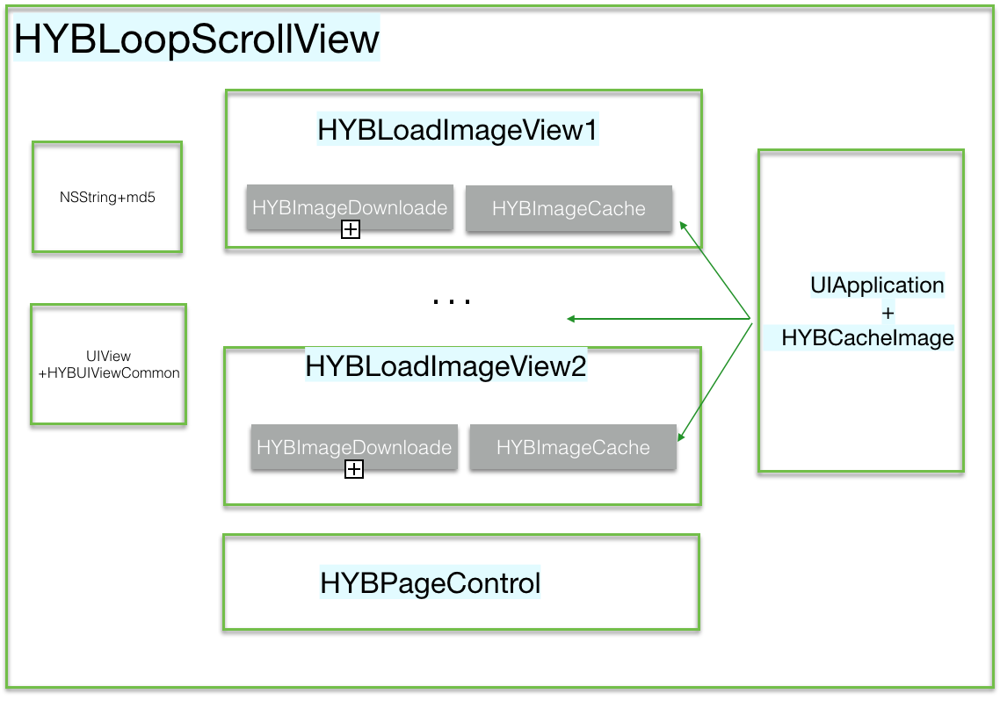

## HYBLoopScrollView (3.0.0)

结构



### UIView+HYBUIViewCommon

方便访问和设置UIView类frame属性和border、cornerRadius样式的category

### HYBPageControl

UIPageControl的封装，只提供了一个value值改变的block属性接口，方便在value值改变时执行block的动作。

### HYBLoadImageView

功能：涉及图片的缓存、剪切压缩、图片下载。

#### NSString+md5

//为字符串生成唯一签名
//这里是采用图片的下载URLString取md5作为唯一key

```
+ (NSString *)hyb_md5:(NSString *)string {
  if (string == nil || [string length] == 0) {
    return nil;
  }
  
  unsigned char digest[CC_MD5_DIGEST_LENGTH], i;
  CC_MD5([string UTF8String], (int)[string lengthOfBytesUsingEncoding:NSUTF8StringEncoding], digest);
  NSMutableString *ms = [NSMutableString string];
  
  for (i = 0; i < CC_MD5_DIGEST_LENGTH; i++) {
    [ms appendFormat:@"%02x", (int)(digest[i])];
  }
  
  return [ms copy];
}
```

#### 缓存管理 HYBImageCache

继承NSCache，借用了它线程安全和内存紧张自动释放的特性。
以URLString的md5值为缓存key。

有一个失败次数统计属性
@property (nonatomic, assign) NSUInteger failTimes;

#### UIApplication+HYBCacheImage

- 采用关联对象生成一个全局字典作为存储容器。
- 全局管理缓存容器的管理分类。
- 以URLString的md5作为key，HYBCacheImage容器为value。
- 每个URLRequest对应一个HYBCacheImage
- 保存image时，先缓存image到HYBCacheImage，然后缓存image的data数据到disk中。
- 请求失败或图片数据解析错误时，递增request对应缓存容器的失败次数。

```
- (NSMutableDictionary *)hyb_cacheImages {
  NSMutableDictionary *caches = objc_getAssociatedObject(self, s_hyb_cacheimages);
  
  if (caches == nil) {
    caches = [[NSMutableDictionary alloc] init];
    
    // Try to get datas from disk
    NSString *directoryPath = [NSHomeDirectory() stringByAppendingString:@"/Documents/HYBLoopScollViewImages"];
    BOOL isDir = NO;
    if ([[NSFileManager defaultManager] fileExistsAtPath:directoryPath isDirectory:&isDir]) {
        
        //一次性把disk中记录全部缓存到hyb_cacheImages中
        //不明白为什么每个图片用单独的NSCache来缓存，是为了方便记录每个request的失败次数吗？代价是否过大了？
      if (isDir) {
        NSError *error = nil;
        NSArray *array = [[NSFileManager defaultManager] contentsOfDirectoryAtPath:directoryPath error:&error];

        if (error == nil) {
          for (NSString *subpath in array) {
            NSData *data = [[NSFileManager defaultManager] contentsAtPath:[directoryPath stringByAppendingPathComponent:subpath]];
            if (data) {
              UIImage *image = [UIImage imageWithData:data];
              if (image) {
                HYBImageCache *cache = [[HYBImageCache alloc] init];
                [cache cacheImage:image forUrl:subpath];
                [caches setObject:cache forKey:subpath];
              }
            }
          }
        }
      }
        
    }
    
    objc_setAssociatedObject(self, s_hyb_cacheimages, caches, OBJC_ASSOCIATION_RETAIN_NONATOMIC);
  }
  
  return caches;
}
```

#### 图片下载器 HYBImageDownloader

- 一个进度HYBDownloadProgressBlock， 一个完成回调HYBDownLoadDataCallBack。
- Reqeust采用NSURLRequestReturnCacheDataElseLoad缓存策略。
  //数据接收类型设置为图片
  [request addValue:@"image/*" forHTTPHeaderField:@"Accept"];
- 请求采用NSURLConnection，在代理方法中处理请求数据和执行状态改变动作。
- 由于请求完成是一次性的调用，在调用结束后需要置空防止重复调用。

#### HYBLoadImageView

##### 特性：

- 继承自UIImageView
- HYBTapImageViewBlock点击回调block
- attemptToReloadTimesForFailedURL图片下载重试次数
- animated属性用于图片切换时的转场动画
	//只有网络下载的图片显示才有动画
	//直接缓存取出图片的时间间隔太短，图片切换动画效果不明显
	if (!isFromCache && _isAnimated) {
    	CATransition *animation = [CATransition animation];
   		[animation setDuration:0.65f];
    	[animation setType:kCATransitionFade];
    	animation.removedOnCompletion = YES;
    	[self.layer addAnimation:animation forKey:@"transition"];
 	 }
 	 
##### 请求过程
 
- 1.获取全局缓存记录，查询缓存图片，会将所有disk图片全部添加到内存缓存中，有对应图片则设置并回调completion
- 2.没有缓存图片，如果设置了占位图则无动画显示
- 3.检查该请求失败次数是否超过设置最大失败数
- 4.请求前初始化，取消正在进行中的请求，初始化一个下载器
- 5.下载失败或图片解析失败则记录失败次数
- 6.下载成功，如需裁剪图片则进行裁剪，然后添加图片到内存缓存和disk中
- 7.显处理后的图片，并回调completion返回下载的原始image

##### 思路整理
	以URLString的md5为key，先将image缓存在自定义的NSCache中，然后借助Runtime在UIApplication分类中弄一个缓存dic，缓存这个能记录请求失败次数的NSCache。这里没有做二级缓存，一开始就将所有的disk记录复制一份到了内存缓存记录dic中。所以后面的图片查找并没有disk的查找。
	这里有几点瑕疵：
	开始下载前会取消当前正在进行的请求，但并未判断是否有请求在进行。即使有请求在进行，在下载器中的取消回调中并未区分失败和直接取消的差别，都会导致请求失败计数递增。不过这种情况发生的可能性可以说微乎其微。
	图片获取后是先执行图片显示设置的处理然后再缓存，这样当图片显示设置改变时，由于缓存的存在将不再起作用。显示图片结束后回调返回的又是原始图片，这一点上比较费解。
	
### HYBLoopScrollView

- 提供了每张图片下面pageControl和文字的布局方式。pageControl居中则文字不显示，居右则文字显示。
- 采用NSTimer进行自动滚动控制。这里的NSTimer需要注意添加到RunLoop的模式。
- 通过scrollViewDidScroll:控制pageControl的显示
- timeInterval改变时需要重置定时器
- imageUrls或者pageControl布局改变时都需要collectionView重新加载数据
- 所谓的循环就是将滚动元素放大50倍，然后子安初始布局执行layoutSubviews时默认显示中间位置。这样左右滚动就会有循环滚动无缝衔接的错觉。在滚动到头部或尾部时默认先滚动到中间再执行前后滚动。缺点也很明显，滚动时到头部或尾部会有卡顿的感觉。
- 调用清空缓存采用的runtime机制，效果是很好，可以达到完全解耦合。但在维护时容易顾此失彼，问题定位也比较困难。
- 图片缓存计算只计算了文件系统也就是disk中的图片，并未计算cache中的图片data数据。这里计算文件大小时借助了文件属性这一特质。
- 元素滚动切换需要转换下元素item的index到imageUrls区间。

特点：

- 自动滚动时滚动流畅无缝衔接，但手动滚动会有UI事件的冲突。
- 不管是缓存方式还是滚动设计思想必然以内存消耗会代价。


`该版本为老版本，新的版本很多可见的问题已经被修复和完善。`


 	 


	


