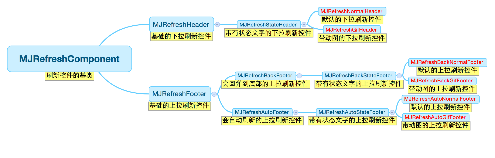

## MJRefresh

- 刷新分为下拉刷新和上拉加载。
- 下拉主要触发数据整体刷新或头部数据新增。上拉主要触发数据加载和没有更多数据的检测。
- 刷新头部和尾部一般会显示下拉动画、状态说明、刷新时间。
- UITableView和UICollectionView以及UIWebView是UIScrollView的子类，所以直接通过操作UIScrollView类即可。

### MJRefresh采用的架构如下：



### 使用三个模块：

- base模块：包含公共常量、宏，UIScrollView等分类，刷新控件的header和footer基类。是头部刷新和尾部刷新控件的基础。
- Header模块：一个能显示状态文字的基础头部刷新控件stateHeader，两个基于它显示普通图片和gif图片的gifheader和normalHeader。
- Footer模块：为了提高在向上滑动列表时查看列表的体验度，提供了两种方式进行上拉加载。一种是手动触发上拉刷新，一种是自动触发上拉刷新。区别在于列表在滑动到底部时上拉触发的偏移量不同。


### 1.先说分类

UIView+MJExtention、UIScrollView+MJExtension
方便使用和设置UIView和UIScrollView的属性。

NSBundle+MJRefresh
方便访问保存语言国际化文件bundle中的具体字段对应的值。

UIScrollView+MJRefresh

这里借用了runtime得属性关联和method swizzling。

1.使用属性关联为UIScrollView添加持有头部和尾部的刷新控件对象的属性。并为刷新控件对象的改变手动添加KVO触发。
2.在+（void)load；中替换UITableView和UICollectionView的reloadData方法，提供在调用数据加载时触发消息得block。

持有控件对象：

```
#pragma mark - header
static const char MJRefreshHeaderKey = '\0';
- (void)setMj_header:(MJRefreshHeader *)mj_header
{
    if (mj_header != self.mj_header) {
        
        // 删除旧的，添加新的
        [self.mj_header removeFromSuperview];
        [self insertSubview:mj_header atIndex:0];
        
        //存储新的
        [self willChangeValueForKey:@"mj_header"]; // KVO
        objc_setAssociatedObject(self, &MJRefreshHeaderKey, mj_header, OBJC_ASSOCIATION_ASSIGN);
        [self didChangeValueForKey:@"mj_header"]; // KVO
    }
}

- (MJRefreshHeader *)mj_header
{
    return objc_getAssociatedObject(self, &MJRefreshHeaderKey);
}
```

提供加载数据时的回调：

```
#pragma mark -
static const char MJRefreshReloadDataBlockKey = '\0';
- (void)setMj_reloadDataBlock:(void (^)(NSInteger))mj_reloadDataBlock
{
    [self willChangeValueForKey:@"mj_reloadDataBlock"]; // KVO
    objc_setAssociatedObject(self, &MJRefreshReloadDataBlockKey, mj_reloadDataBlock, OBJC_ASSOCIATION_COPY_NONATOMIC);
    [self didChangeValueForKey:@"mj_reloadDataBlock"]; // KVO
}

- (void (^)(NSInteger))mj_reloadDataBlock
{
    return objc_getAssociatedObject(self, &MJRefreshReloadDataBlockKey);
}
```

交换方法：

```
@implementation UITableView (MJRefresh)

+ (void)load
{
    [self exchangeInstanceMethod1:@selector(reloadData) method2:@selector(mj_reloadData)];
}

- (void)mj_reloadData
{
    [self mj_reloadData];
    
    [self executeReloadDataBlock];
}
@end
```

### 2.基类MJRefreshComponent


思路：
```
1.先创建刷新控件对象，并绑定刷新触发动作，然后由scrollView的分类属性持有并插入到scrollView的最底层。
2.重载`- (void)willMoveToSuperview:(UIView *)newSuperview`方法，在添加到scrollView上时进行初始化、保存相关属性、注册KVO监听。
3.MJRefresh巧妙使用了职责分离的技巧，使用方法重载将对KVO的响应转移到子类中。
4.记录了scrollView的原有contentInsets，方便后面在刷新状态和结束状态直接的设置还原。
5.通过监听scrollView的垂直滚动偏移值和拖拉状态进行刷新控件的状态修改，并通过偏移值控制组件的透明度。
6.通过监听scrollView拖拉手势结束，判断偏移值、insets、contentSize来判断是否需要进行上拉自动加载。
7.子类通过重载状态设置、布局等方法完成自身功能的设置。实现职责逐层分解简化。
```

刷新控件的状态：
```
typedef NS_ENUM(NSInteger, MJRefreshState) {
    /** 普通闲置状态 */
    MJRefreshStateIdle = 1,
    /** 松开就可以进行刷新的状态 */
    MJRefreshStatePulling,
    /** 正在刷新中的状态 */
    MJRefreshStateRefreshing,
    /** 即将刷新的状态 */
    MJRefreshStateWillRefresh,
    /** 所有数据加载完毕，没有更多的数据了 */
    MJRefreshStateNoMoreData
};
```

在添加到父类控件上时进行初始设置
```
- (void)willMoveToSuperview:(UIView *)newSuperview
{
    [super willMoveToSuperview:newSuperview];
    
    // 如果不是UIScrollView，不做任何事情
    if (newSuperview && ![newSuperview isKindOfClass:[UIScrollView class]]) return;
    // 旧的父控件移除监听
    [self removeObservers];
    
    if (newSuperview) { // 新的父控件
        // 设置宽度
        self.mj_w = newSuperview.mj_w;
        self.mj_x = -_scrollView.mj_insetL;
        
        // 记录UIScrollView
        _scrollView = (UIScrollView *)newSuperview;
        _scrollView.alwaysBounceVertical = YES;
        _scrollViewOriginalInset = _scrollView.mj_inset;
        
        // 添加监听
        [self addObservers];
    }
}
```

交给子类们去实现，用于子控件布局
```
/** 初始化 */
- (void)prepare NS_REQUIRES_SUPER;
/** 摆放子控件frame */
- (void)placeSubviews NS_REQUIRES_SUPER;
```

KVO监听scrollView的contentOffset、contentSize、拖拉手势状态
```
- (void)scrollViewContentOffsetDidChange:(NSDictionary *)change ;
- (void)scrollViewContentSizeDidChange:(NSDictionary *)change ;
- (void)scrollViewPanStateDidChange:(NSDictionary *)change ;
```

开始刷新
```
- (void)beginRefreshing
{
    [UIView animateWithDuration:MJRefreshFastAnimationDuration animations:^{
        self.alpha = 1.0;
    }];
    self.pullingPercent = 1.0;
    // 只要正在刷新，就完全显示
    if (self.window) {
        self.state = MJRefreshStateRefreshing;
    } else {
        // 预防正在刷新中时，调用本方法使得header inset回置失败
        if (self.state != MJRefreshStateRefreshing) {
            self.state = MJRefreshStateWillRefresh;
            // 刷新(预防从另一个控制器回到这个控制器的情况，回来要重新刷新一下)
            [self setNeedsDisplay];
        }
    }
}

- (void)beginRefreshingWithCompletionBlock:(void (^)(void))completionBlock
{
    self.beginRefreshingCompletionBlock = completionBlock;
    [self beginRefreshing];
}
```

结束刷新
```
- (void)endRefreshing
{
    dispatch_async(dispatch_get_main_queue(), ^{
        self.state = MJRefreshStateIdle;
    });
}

- (void)endRefreshingWithCompletionBlock:(void (^)(void))completionBlock
{
    self.endRefreshingCompletionBlock = completionBlock;
    
    [self endRefreshing];
}
```

修改状态
```
- (void)setState:(MJRefreshState)state
{
    _state = state;
    
    // 加入主队列的目的是等setState:方法调用完毕、设置完文字后再去布局子控件
    dispatch_async(dispatch_get_main_queue(), ^{
        [self setNeedsLayout];
    });
}
```

根据拖拽进度设置透明度
```
- (void)setPullingPercent:(CGFloat)pullingPercent
{
    _pullingPercent = pullingPercent;
    
    if (self.isRefreshing) return;
    
    if (self.isAutomaticallyChangeAlpha) {
        self.alpha = pullingPercent;
    }
}
```


### 3.头部刷新控件

将文字显示和图片显示的职责分离，由MJRefreshStateHeader控制不同状态下的状态文字显示

MJRefreshNormalHeader  控制静态图片的状态显示

MJRefreshGifHeader 控制动态图片的状态显示


### 4.尾部刷新控件

MJRefreshFooter功能比较简单，将控件的位置初始设置上移到了MJRefreshAutoFooter和MJRefreshBackFooter中。

分为手动刷新和自动刷新。

手动刷新：
```
MJRefreshAutoFooter 初始化配置并监督自动刷新
MJRefreshBackStateFooter 控制不同状态下的状态文字显示
MJRefreshAutoNormalFooter 控制静态图片的状态显示
MJRefreshAutoGifFooter 控制动态图片的状态显示
```

自动刷新：
```
MJRefreshBackFooter 初始化配置
MJRefreshBackStateFooter 控制不同状态下的状态文字显示
MJRefreshBackNormalFooter 控制静态图片的状态显示
MJRefreshBackGifFooter 控制动态图片的状态显示
```


