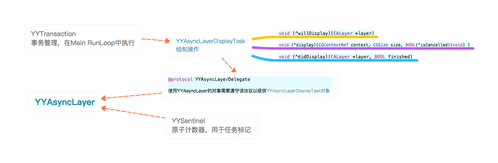

## YYAsyncLayer

#### 结构：



#### 思路：

- 1.先设置要绘制的参数，将绘制动作调用消息保留在事务中
- 2.当main runLoop进入空闲时执行事务中的绘制动作
- 3.执行绘制操作时会向YYAsyncLayer的代理对象，也就是layer的容器对象，获取绘制任务对象YYAsyncLayerDisplayTask
- 4.通过原子计数管理对象YYSentinel，将任务与原子数值绑定以判断任务是否已经取消，在执行任务时会先保留当前原子计数值
- 5.执行绘制任务，在创建绘制环境后执行绘制操作，创建绘制的图片并显示在layer的content中
- 6.任务取消会修改原子计数值，在绘制过程中要在各阶段区检验任务是否已经被取消，反正重复验证

###  @protocol YYAsyncLayerDelegate

```
@protocol YYAsyncLayerDelegate <NSObject>
@required
/// This method is called to return a new display task when the layer's contents need update.
- (YYAsyncLayerDisplayTask *)newAsyncDisplayTask;
@end
```

### YYAsyncLayerDisplayTask

将要开始异步绘制前被调用，在主线程被调用
`@property (nullable, nonatomic, copy) void (^willDisplay)(CALayer *layer);`

异步绘制时被调用，可能在主线程也可能是后台线程
`@property (nullable, nonatomic, copy) void (^display)(CGContextRef context, CGSize size, BOOL(^isCancelled)(void) );`

异步绘制完成时被调用，在主线程被调用
`@property (nullable, nonatomic, copy) void (^didDisplay)(CALayer *layer, BOOL finished);`

### YYAsyncLayer

#### 异步绘制随机返回队列集合中一个串行队列

```
static dispatch_queue_t YYAsyncLayerGetDisplayQueue() {
    
#ifdef YYDispatchQueuePool_h
    return YYDispatchQueueGetForQOS(NSQualityOfServiceUserInitiated);
#else
    
#define MAX_QUEUE_COUNT 16
    
    static int queueCount;
    static dispatch_queue_t queues[MAX_QUEUE_COUNT];
    static int32_t counter = 0;
    
    //初始化队列集合
    static dispatch_once_t onceToken;
    dispatch_once(&onceToken, ^{
        
        //队列数
        queueCount = (int)[NSProcessInfo processInfo].activeProcessorCount;
        queueCount = queueCount < 1 ? 1 : queueCount > MAX_QUEUE_COUNT ? MAX_QUEUE_COUNT : queueCount;
        
        //创建queueCount个串行队列并添加到队列数组中
        if ([UIDevice currentDevice].systemVersion.floatValue >= 8.0) {
            
            for (NSUInteger i = 0; i < queueCount; i++) {
                dispatch_queue_attr_t attr = dispatch_queue_attr_make_with_qos_class(DISPATCH_QUEUE_SERIAL, QOS_CLASS_USER_INITIATED, 0);
                queues[i] = dispatch_queue_create("com.ibireme.yykit.render", attr);
            }
        } else {
            
            for (NSUInteger i = 0; i < queueCount; i++) {
                queues[i] = dispatch_queue_create("com.ibireme.yykit.render", DISPATCH_QUEUE_SERIAL);
                dispatch_set_target_queue(queues[i], dispatch_get_global_queue(DISPATCH_QUEUE_PRIORITY_DEFAULT, 0));
            }
        }
    });
    
    //从队列集合中随机返回一个队列
    int32_t cur = OSAtomicIncrement32(&counter);
    if (cur < 0) cur = -cur;
    return queues[(cur) % queueCount];
    
#undef MAX_QUEUE_COUNT
#endif
    
}
```

#### 释放绘制图片占用内存的队列

```
static dispatch_queue_t YYAsyncLayerGetReleaseQueue() {
#ifdef YYDispatchQueuePool_h
    return YYDispatchQueueGetForQOS(NSQualityOfServiceDefault);
#else
    return dispatch_get_global_queue(DISPATCH_QUEUE_PRIORITY_LOW, 0);
#endif
}
```

#### 重载属性访问方法

异步绘制displaysAsynchronously默认开启。

```
+ (id)defaultValueForKey:(NSString *)key {
    
    if ([key isEqualToString:@"displaysAsynchronously"]) {
        return @(YES);//默认值
    } else {
        return [super defaultValueForKey:key];
    }
}
```

#### 重载重绘方法setNeedsDisplay

每次重绘时需要取消当前绘制任务，并且发送绘制更新消息

```
- (void)setNeedsDisplay {
    //绘制时会增加原子计数来取消当前的绘制操作
    [self _cancelAsyncDisplay];
    
    [super setNeedsDisplay];//会调用- (void)display;方法
}
```

#### 重载绘制方法display

重绘时会自动触发- (void)dispaly方法

```
在layer重新机制内容时会自动调用，不应该手动调用
- (void)display {
    super.contents = super.contents;
    
    //进行绘制
    [self _displayAsync:_displaysAsynchronously];
}
```

#### 取消绘制

```
- (void)_cancelAsyncDisplay {
    [_sentinel increase];
}
```

#### 绘制

 - 使用YYSentinel进行原子计数，通过每次开启异步绘制任务时，记录初始值和sentinel对象。并在绘制任务取消时增加原子计数。
 - 然后在渲染的不同阶段进行比较原子计数的比较，判断任务是否取消。取消则结束绘制并在主线程调用didDisplay block。
 - 将需要显示的内容先绘制成图片，然后显示出来。将上下文传给代理的display block，在代理对象中完成绘制操作

```
- (void)_displayAsync:(BOOL)async {
    
    __strong id<YYAsyncLayerDelegate> delegate = (id<YYAsyncLayerDelegate>)self.delegate;
    YYAsyncLayerDisplayTask *task = [delegate newAsyncDisplayTask];
    
    //绘制操作为空，则直接开始并结束
    if (!task.display) {
        if (task.willDisplay) task.willDisplay(self);
        self.contents = nil;
        if (task.didDisplay) task.didDisplay(self, YES);
        return;
    }
    
    //异步执行
    if (async) {
        if (task.willDisplay) task.willDisplay(self);
        
        //如果绘制任务取消sentinel计数会改变，痛殴block的拷贝原计数值和sentinel对象指针来判断不同时间的计数值是否一致
        YYSentinel *sentinel = _sentinel;
        int32_t value = sentinel.value;
        BOOL (^isCancelled)() = ^BOOL() {
            return value != sentinel.value;
        };
        
        CGSize size = self.bounds.size;
        BOOL opaque = self.opaque;
        CGFloat scale = self.contentsScale;
        
        //上下文环境长宽小于1，则直接清空layer内容
        if (size.width < 1 || size.height < 1) {
            CGImageRef image = (__bridge_retained CGImageRef)(self.contents);
            self.contents = nil;
            if (image) {
                dispatch_async(YYAsyncLayerGetReleaseQueue(), ^{
                    CFRelease(image);
                });
            }
            if (task.didDisplay) task.didDisplay(self, YES);
            return;
        }
        
        //异步绘制
        dispatch_async(YYAsyncLayerGetDisplayQueue(), ^{
            
            if (isCancelled()) return;
            
            UIGraphicsBeginImageContextWithOptions(size, opaque, scale);
            CGContextRef context = UIGraphicsGetCurrentContext();
            task.display(context, size, isCancelled);
            
            //绘制操作完成判断是否已经被取消
            if (isCancelled()) {
                UIGraphicsEndImageContext();
                dispatch_async(dispatch_get_main_queue(), ^{
                    if (task.didDisplay) task.didDisplay(self, NO);
                });
                return;
            }
            
            //从渲染环境中获取渲染后的图片
            UIImage *image = UIGraphicsGetImageFromCurrentImageContext();
            UIGraphicsEndImageContext();
            
            //绘制结束是否已经被取消
            if (isCancelled()) {
                dispatch_async(dispatch_get_main_queue(), ^{
                    if (task.didDisplay) task.didDisplay(self, NO);
                });
                return;
            }
            
            //主线程结束回调，或者显示绘制内容
            dispatch_async(dispatch_get_main_queue(), ^{
                if (isCancelled()) {
                    if (task.didDisplay) task.didDisplay(self, NO);
                } else {
                    self.contents = (__bridge id)(image.CGImage);
                    if (task.didDisplay) task.didDisplay(self, YES);
                }
            });
        });
        
    }
    //同步执行
    else {
        
        [_sentinel increase];
        
        if (task.willDisplay) task.willDisplay(self);
        
        UIGraphicsBeginImageContextWithOptions(self.bounds.size, self.opaque, self.contentsScale);
        CGContextRef context = UIGraphicsGetCurrentContext();
        
        task.display(context, self.bounds.size, ^{return NO;});
        
        UIImage *image = UIGraphicsGetImageFromCurrentImageContext();
        UIGraphicsEndImageContext();
        self.contents = (__bridge id)(image.CGImage);
  
        if (task.didDisplay) task.didDisplay(self, YES);
    }
}
```


## YYSentinel

头文件

```
线程安全的自动增长技术，它能被用于多线程情形。这里通过引用计数来区分不同绘制任务。

@interface YYSentinel : NSObject

@property (readonly) int32_t value;

- (int32_t)increase;

@end
```

实现文件

```
#import "YYSentinel.h"
#import <libkern/OSAtomic.h>

@implementation YYSentinel {
    int32_t _value;
}

- (int32_t)value {
    return _value;
}

//原子操作，递增引用计数
- (int32_t)increase {
    return OSAtomicIncrement32(&_value);
}

@end
```

## YYTransaction

- YYTranscation对象持有需要执行的UI操作selector和对应的target，通过一个全局set集合装载要执行的transcations。
- 通过创建CFRunLoopObserverRef观察者监听Main RunLoop进入sleep和exit的状态。
- 在main runLoop进入sleep时回调执行set中多有transcation，并清空set
- 这样可以保证竟可能不影响UI操作，在执行事务期间一样能响应用户操作，是屏幕的FPS尽量接近60FPS

#### 创建事务

```
+ (YYTransaction *)transactionWithTarget:(id)target selector:(SEL)selector{
    if (!target || !selector) return nil;
    
    YYTransaction *t = [YYTransaction new];
    t.target = target;
    t.selector = selector;
    
    return t;
}
```

#### 提交事务

提交事务到set集合中。当主线程的runLoop进入sleep时会开始执行。如果相同的transaction已经在loop中，则当前提交的不执行

```
- (void)commit {
    if (!_target || !_selector) return;
    
    YYTransactionSetup();
    [transactionSet addObject:self];
}
```

#### 等同性判断

用于多事务集合set中添加相同事务时进行判断，移除重复绘制操作。

```
- (NSUInteger)hash {
    long v1 = (long)((void *)_selector);
    long v2 = (long)_target;
    return v1 ^ v2;
}

- (BOOL)isEqual:(id)object {
    
    //是否是同一实例
    if (self == object) return YES;
    //不是该类型
    if (![object isMemberOfClass:self.class]) return NO;
    //selector和target相同
    YYTransaction *other = object;
    return other.selector == _selector && other.target == _target;
}
```

#### 监听main runLoop的状态

```
static void YYTransactionSetup() {
    static dispatch_once_t onceToken;
    dispatch_once(&onceToken, ^{
        //事务集合
        transactionSet = [NSMutableSet new];
        
        //主队列的runLoop
        CFRunLoopRef runloop = CFRunLoopGetMain();
        
        //创建观察runLoop进入等待和退出的观察者
        CFRunLoopObserverRef observer;
        observer = CFRunLoopObserverCreate(CFAllocatorGetDefault(),
                                           kCFRunLoopBeforeWaiting | kCFRunLoopExit,
                                           true,      // repeat
                                           0xFFFFFF,  // after CATransaction(2000000)
                                           YYRunLoopObserverCallBack, NULL);
        //绑定main runLoop和observer，监听runLoop的所有模式
        CFRunLoopAddObserver(runloop, observer, kCFRunLoopCommonModes);
        CFRelease(observer);
    });
}
```

#### runLoop监听回调

在main runLoop进入sleep阶段时回调该方法，执行其中的selector集合

```
static void YYRunLoopObserverCallBack(CFRunLoopObserverRef observer, CFRunLoopActivity activity, void *info) {
    if (transactionSet.count == 0) return;
    
    NSSet *currentSet = transactionSet;
    
    transactionSet = [NSMutableSet new];
    [currentSet enumerateObjectsUsingBlock:^(YYTransaction *transaction, BOOL *stop) {
#pragma clang diagnostic push
#pragma clang diagnostic ignored "-Warc-performSelector-leaks"
        [transaction.target performSelector:transaction.selector];
#pragma clang diagnostic pop
    }];
}
```