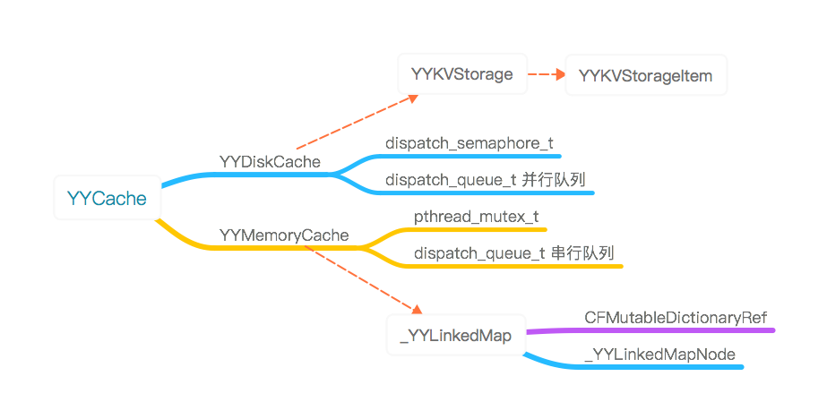

## YYCache

### 结构

### YYCache

简介：

 - 缓存对象会被缓存到disk和memory中
 - YYMemoryCache管理memory区域的缓存
 - YYDiskCache管理disk区域的缓存
 - YYMemoryCache会使用CFMutableDictionaryRef存储，YYDiskCache会借助YYKVStorage来存储在sqlite或文件系统中
 - 通过在初始化实例时传入一个name或path以区分不同的实例对象，相同的名称或path会导致Cache对象不稳定
 - 因为YYMemoryCache和YYDiskCache使用了锁保证线程安全，因此YYCache也是线程安全的

### YYMemoryCache

简介：

- 使用dispatch_after进行本地缓存各种限制条件的轮询检查和处理
- 将存储对象作为节点，使用CFMutableDictionaryRef进行存储，采用链表方式进行管理。使用LRU/MRU算法，最新访问的放在链表头部，最先移除链表尾部
- 监听应用进入后台和系统内存警告，进行内存清理
- 使用一个串行队列dispatch_queue_t对多个缓存限制条件进行逐步清理
- 使用一个pthread_mutex_t互斥锁来对链表的增删改查进行线程保护

### YYDiskCache

简介：

- 使用dispatch_after进行本地缓存各种限制条件的轮询检查和处理
- 采用一个static的NSMapTable进行全局diskCache的存储，保证多次创建都使用的是同一对象，使用信号量机制访问。
- 持有一个YYKVStorage进行对象的存储，采用数据库sqlite和文件系统两种方式进行存储管理，根据存储对象自动判断存储方式采用sqlite或File System
- 监听应用退出通知，将KVStroage对象释放
- 采用并行队列对YYKVStorage中存储的数据进行增删查改，只用全局宏定义信号量锁进行数据的线程安全保护。
- 所有block的回调一致采用在后台并行队列中返回。
- 缓存对象的extended data采用对象关联保存在YYDiskCache类单例里。在存储和访问缓存对象时进行保存和访问。
 ，当内存不足时，按照LRU算法自动移除部分对象
 
 
### YYKVStorage

简介：

 - YYKVStorage是基于sqlite数据和文件系统两种方式的存储
 - 线程不安全的，确保同一时间只有一个线程在访问。或者建立多个KVStorage分开进行存储。
 - 保存对象时，不管是数据库保存还是文件系统保存，都采用sqlite记录该条缓存记录，缓存的data数据则根据缓存类型保存到对应的地方。只需要检查sqlite记录中是否有fileName，便可知data数据是保存在数据库还是文件系统。
 - 存在fileName但文件系统中查找不到时说明sqlite记录的是一条脏数据，需要被清理。
 - 文件路径下有三个sqlite数据库、一个用于存放缓存数据的data文件夹、一个用于多次存放data文件下数据的trash文件夹。当清空所有数据时，先一次性转移data文件夹下所有数据到trash下一个新建的文件夹，然后再逐次移除trash文件下所有数据	