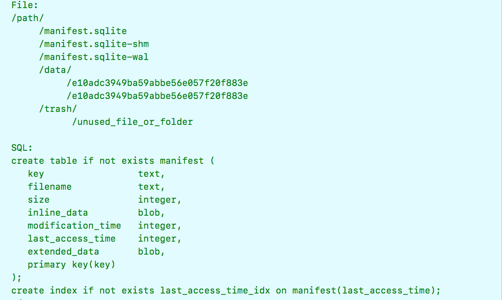

## YYKVStorage

简介：

 - YYKVStorage是基于sqlite数据和文件系统两种方式的存储
 - 线程不安全的，确保同一时间只有一个线程在访问。或者建立多个KVStorage分开进行存储。
 - 保存对象时，不管是数据库保存还是文件系统保存，都采用sqlite记录该条缓存记录，缓存的data数据则根据缓存类型保存到对应的地方。只需要检查sqlite记录中是否有fileName，便可知data数据是保存在数据库还是文件系统。
 - 存在fileName但文件系统中查找不到时说明sqlite记录的是一条脏数据，需要被清理。
 - 文件路径下有三个sqlite数据库、一个用于存放缓存数据的data文件夹、一个用于多次存放data文件下数据的trash文件夹。当清空所有数据时，先一次性转移data文件夹下所有数据到trash下一个新建的文件夹，然后再逐次移除trash文件下所有数据	

#### 文件结构图



##### 在实例销毁时，dealloc方法中需要向系统申请一段时间去关闭数据库 

```
- (void)dealloc {
    //app退出时申请后台运行时间进行数据库的关闭，因为关闭时间很短，并不需要在超时block里面进行endBackgroundTask处理
    UIBackgroundTaskIdentifier taskID = [_YYSharedApplication() beginBackgroundTaskWithExpirationHandler:^{}];
    [self _dbClose];
    if (taskID != UIBackgroundTaskInvalid) {
        [_YYSharedApplication() endBackgroundTask:taskID];
    }
}
```

#### 获取

##### 获取YYKVStorageItem

```
- (YYKVStorageItem *)getItemForKey:(NSString *)key {
    if (key.length == 0) return nil;
    
    //数据库获取记录
    YYKVStorageItem *item = [self _dbGetItemWithKey:key excludeInlineData:NO];
    if (item) {
        //更新访问时间
        [self _dbUpdateAccessTimeWithKey:key];
        
        //保存在文件系统中
        if (item.filename) {
            //从文件系统读取文件数据
            item.value = [self _fileReadWithName:item.filename];
            if (!item.value) {
                //脏记录，删除数据库对应记录
                [self _dbDeleteItemWithKey:key];
                item = nil;
            }
        }
    }
    return item;
}
```

##### 获取Data

```
- (NSData *)getItemValueForKey:(NSString *)key {
    if (key.length == 0) return nil;
    
    NSData *value = nil;
    switch (_type) {
        case YYKVStorageTypeFile: {
            NSString *filename = [self _dbGetFilenameWithKey:key];
            if (filename) {
                value = [self _fileReadWithName:filename];
                if (!value) {
                    [self _dbDeleteItemWithKey:key];
                    value = nil;
                }
            }
        } break;
        case YYKVStorageTypeSQLite: {
            value = [self _dbGetValueWithKey:key];
        } break;
        case YYKVStorageTypeMixed: {
            //通过文件名来判断从文件系统查询还是从数据库中查询
            NSString *filename = [self _dbGetFilenameWithKey:key];
            if (filename) {
                value = [self _fileReadWithName:filename];
                if (!value) {
                    [self _dbDeleteItemWithKey:key];
                    value = nil;
                }
            } else {
                value = [self _dbGetValueWithKey:key];
            }
        } break;
    }
    
    //有数据则更新访问时间记录
    if (value) {
        [self _dbUpdateAccessTimeWithKey:key];
    }
    return value;
}

```

#### 保存

```
- (BOOL)saveItemWithKey:(NSString *)key value:(NSData *)value filename:(NSString *)filename extendedData:(NSData *)extendedData {
    
    if (key.length == 0 || value.length == 0) return NO;
    if (_type == YYKVStorageTypeFile && filename.length == 0) {
        return NO;
    }
    
    if (filename.length) {
        //文件系统保存
        if (![self _fileWriteWithName:filename data:value]) {
            return NO;
        }
        //文件系统保存成功，尝试保存到sqlite
        if (![self _dbSaveWithKey:key value:value fileName:filename extendedData:extendedData]) {
           // sqlite保存失败，删除之前文件系统保存的文件
            [self _fileDeleteWithName:filename];
            return NO;
        }
        return YES;
    } else {
        //需要进行文件系统保存，删除同名的文件
        if (_type != YYKVStorageTypeSQLite) {
            NSString *filename = [self _dbGetFilenameWithKey:key];
            if (filename) {
                [self _fileDeleteWithName:filename];
            }
        }
        //数据库保存
        return [self _dbSaveWithKey:key value:value fileName:nil extendedData:extendedData];
    }
}
```

#### 删除

##### 单个删除

```
- (BOOL)removeItemForKey:(NSString *)key {
    if (key.length == 0) return NO;
    
    switch (_type) {
        case YYKVStorageTypeSQLite: {
            return [self _dbDeleteItemWithKey:key];
        } break;
        case YYKVStorageTypeFile:
        case YYKVStorageTypeMixed: {
            NSString *filename = [self _dbGetFilenameWithKey:key];
            if (filename) {
                [self _fileDeleteWithName:filename];
            }
            return [self _dbDeleteItemWithKey:key];
        } break;
        default: return NO;
    }
}
```

##### 将缓存总大小移除降低到maxSize以下

```
- (BOOL)removeItemsToFitSize:(int)maxSize {
    if (maxSize == INT_MAX) return YES;
    if (maxSize <= 0) return [self removeAllItems];
    
    int total = [self _dbGetTotalItemSize];
    if (total < 0) return NO;
    if (total <= maxSize) return YES;
    
    //循环取出16条记录，逐次删除检查剩余大小是否已低于限制大小
    NSArray *items = nil;
    BOOL suc = NO;
    do {
        int perCount = 16;
        items = [self _dbGetItemSizeInfoOrderByTimeAscWithLimit:perCount];
        for (YYKVStorageItem *item in items) {
            if (total > maxSize) {
                if (item.filename) {
                    [self _fileDeleteWithName:item.filename];
                }
                suc = [self _dbDeleteItemWithKey:item.key];
                total -= item.size;
            } else {
                break;
            }
            if (!suc) break;
        }
    } while (total > maxSize && items.count > 0 && suc);
    if (suc) [self _dbCheckpoint];
    return suc;
}
```

#### 移除所有文件到trash文件夹

```
- (BOOL)_fileMoveAllToTrash {
    //生成随机UUID
    CFUUIDRef uuidRef = CFUUIDCreate(NULL);
    CFStringRef uuid = CFUUIDCreateString(NULL, uuidRef);
    CFRelease(uuidRef);
    //将dataPath下数据移除到垃圾文件下新的文件夹下
    NSString *tmpPath = [_trashPath stringByAppendingPathComponent:(__bridge NSString *)(uuid)];
    BOOL suc = [[NSFileManager defaultManager] moveItemAtPath:_dataPath toPath:tmpPath error:nil];
    if (suc) {
        //移除成功则用空文件夹覆盖dataPath文件夹，达到一次清空的效果
        suc = [[NSFileManager defaultManager] createDirectoryAtPath:_dataPath withIntermediateDirectories:YES attributes:nil error:NULL];
    }
    CFRelease(uuid);
    return suc;
}
```

#### 在后台清空trash文件夹下数据

在串行队列中异步删除

```
- (void)_fileEmptyTrashInBackground {
    NSString *trashPath = _trashPath;
    dispatch_queue_t queue = _trashQueue;
    //串行队列清空垃圾文件夹
    dispatch_async(queue, ^{
        NSFileManager *manager = [NSFileManager new];
        NSArray *directoryContents = [manager contentsOfDirectoryAtPath:trashPath error:NULL];
        for (NSString *path in directoryContents) {
            NSString *fullPath = [trashPath stringByAppendingPathComponent:path];
            [manager removeItemAtPath:fullPath error:NULL];
        }
    });
}
```


#### 存储器重置

```
- (void)_reset {
    
    //移除缓存目录下所有sqlite文件
    [[NSFileManager defaultManager] removeItemAtPath:[_path stringByAppendingPathComponent:kDBFileName] error:nil];
    [[NSFileManager defaultManager] removeItemAtPath:[_path stringByAppendingPathComponent:kDBShmFileName] error:nil];
    [[NSFileManager defaultManager] removeItemAtPath:[_path stringByAppendingPathComponent:kDBWalFileName] error:nil];
    
    //先将文件一次移到垃圾目录
    [self _fileMoveAllToTrash];
    
    //在后台清空垃圾文件夹下
    [self _fileEmptyTrashInBackground];
}
```
