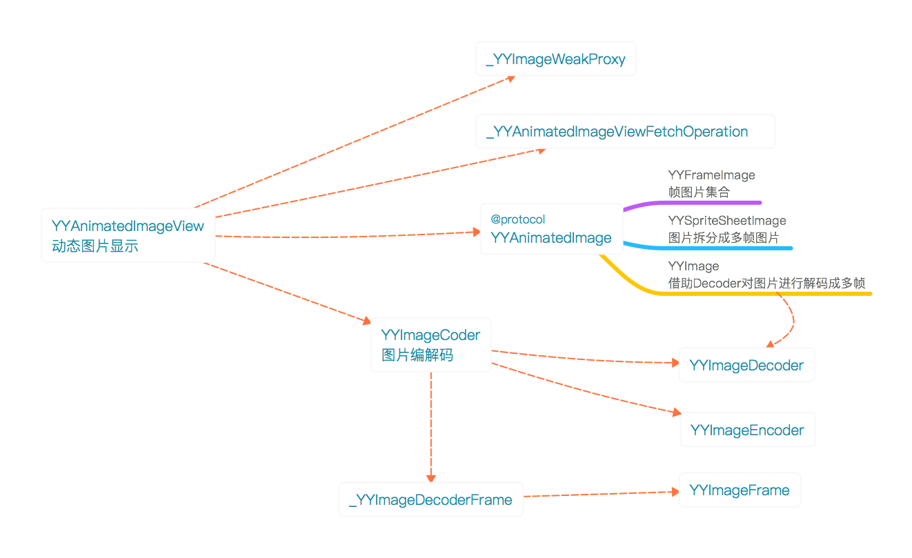

## YYImage

`架构：`




### YYImage

 - 继承UIImage，支持WebP、APNG、Gif格式图片数据的解码，也支持NSCoding协议去解压缩多帧图片数据。
 - 可以使用YYAnimatedImageView代替UIImageView去显示多帧图片数据。
 - 继承YYAnimatedImage协议，为动态图的显示提供信息。
 - 持有一个解码器decoder，用于解析图片数据。

#### 提取图片名称中的scale值

```
获取图片名称中的scale参数
static CGFloat _NSStringPathScale(NSString *string) {
    if (string.length == 0 || [string hasSuffix:@"/"]) return 1;
    
    NSString *name = string.stringByDeletingPathExtension;
    __block CGFloat scale = 1;

    NSRegularExpression *pattern = [NSRegularExpression regularExpressionWithPattern:@"@[0-9]+\\.?[0-9]*x$" options:NSRegularExpressionAnchorsMatchLines error:nil];
    [pattern enumerateMatchesInString:name options:kNilOptions range:NSMakeRange(0, name.length) usingBlock:^(NSTextCheckingResult *result, NSMatchingFlags flags, BOOL *stop) {
        if (result.range.location >= 3) {
            scale = [string substringWithRange:NSMakeRange(result.range.location + 1, result.range.length - 2)].doubleValue;
        }
    }];
    return scale;
}
```

#### 为图片名称添加scale

```
static NSString *_NSStringByAppendingNameScale(NSString *string, CGFloat scale) {
    if (!string ) return nil;
    if (fabs(scale - 1) <= __FLT_EPSILON__ || string.length == 0 || [string hasSuffix:@"/"]) return string.copy;
    return [string stringByAppendingFormat:@"@%@x", @(scale)];
}
```

#### 持有实例变量

```
@implementation YYImage
{
    YYImageDecoder *_decoder;//图片解码器，用于图片解析
    NSArray *_preloadedFrames;//预加载的帧图片集合
    dispatch_semaphore_t _preloadedLock;//信号量，用于预加载图片容器的线程安全访问
    NSUInteger _bytesPerFrame;//帧图片大小
}
```
 
#### 图片创建方式

分为按图片名称和图片数据创建YYImage的方式

##### 通过图片名创建

图片名称创建需要检测图片的分辨率倍数scale和图片格式后缀，然后在本地bundle中查找该图片路径，存在则读取图片数据。

考虑到scale和图片格式不能从名称中获取，会尝试从scale集合和图片格式集合中取值进行图片路径查找，存在说明存在对应的图片。

```
通过图片名创建图片
+ (YYImage *)imageNamed:(NSString *)name {
    
    if (name.length == 0) return nil;
    if ([name hasSuffix:@"/"]) return nil;
    
    NSString *res = name.stringByDeletingPathExtension;
    NSString *ext = name.pathExtension;
    NSString *path = nil;
    CGFloat scale = 1;
    
    //支持的格式后缀和屏幕scale集合
    NSArray *exts = ext.length > 0 ? @[ext] : @[@"", @"png", @"jpeg", @"jpg", @"gif", @"webp", @"apng"];
    NSArray *scales = _NSBundlePreferredScales();
    
    //通过给图片名称后面尝试不同的scale和格式后缀，在bundle中查找，存在则格式正确
    for (int s = 0; s < scales.count; s++) {
        scale = ((NSNumber *)scales[s]).floatValue;
        NSString *scaledName = _NSStringByAppendingNameScale(res, scale);
        for (NSString *e in exts) {
            path = [[NSBundle mainBundle] pathForResource:scaledName ofType:e];
            if (path) break;
        }
        if (path) break;
    }
    if (path.length == 0) return nil;
    
    //获取数据
    NSData *data = [NSData dataWithContentsOfFile:path];
    if (data.length == 0) return nil;
    
    return [[self alloc] initWithData:data scale:scale];
}
```

##### 通过图片数据创建

这是核心方法

```
通过图片数据创建图片，这里会初始化一个信号量，暴增预加载图片数据集合访问的线程安全
- (instancetype)initWithData:(NSData *)data scale:(CGFloat)scale {
    if (data.length == 0) return nil;
    
    if (scale <= 0) scale = [UIScreen mainScreen].scale;
    _preloadedLock = dispatch_semaphore_create(1);
    
    //使用自动释放驰防止图片解码占用内存暴增
    @autoreleasepool {
        //解码器
        YYImageDecoder *decoder = [YYImageDecoder decoderWithData:data scale:scale];
        //默认显示第一帧
        YYImageFrame *frame = [decoder frameAtIndex:0 decodeForDisplay:YES];
        UIImage *image = frame.image;
        if (!image) return nil;
        
        self = [self initWithCGImage:image.CGImage scale:decoder.scale orientation:image.imageOrientation];
        if (!self) return nil;
        
        _animatedImageType = decoder.type;
        
        //保存动态图信息
        if (decoder.frameCount > 1) {
            _decoder = decoder;
            //以第一帧图片的大小作为所有帧图片的内存占用大小
            _bytesPerFrame = CGImageGetBytesPerRow(image.CGImage) * CGImageGetHeight(image.CGImage);
            _animatedImageMemorySize = _bytesPerFrame * decoder.frameCount;
        }
        //图片是解码显示
        self.yy_isDecodedForDisplay = YES;
    }
    return self;
}
```

#### 预加载帧图片

为了提高图片显示效率，可以提前对加载的动态图进行处理，提前加载所有帧图片到一个公共集合对象中。

```
- (void)setPreloadAllAnimatedImageFrames:(BOOL)preloadAllAnimatedImageFrames {
    
    if (_preloadAllAnimatedImageFrames != preloadAllAnimatedImageFrames) {
        
        //需要预加载
        if (preloadAllAnimatedImageFrames && _decoder.frameCount > 0) {
            
            //获取每一帧图片
            NSMutableArray *frames = [NSMutableArray new];
            for (NSUInteger i = 0, max = _decoder.frameCount; i < max; i++) {
                UIImage *img = [self animatedImageFrameAtIndex:i];
                if (img) {
                    [frames addObject:img];
                } else {
                    [frames addObject:[NSNull null]];
                }
            }
            //将_preloadedFrames指向预加载图片集合容器
            dispatch_semaphore_wait(_preloadedLock, DISPATCH_TIME_FOREVER);
            _preloadedFrames = frames;
            dispatch_semaphore_signal(_preloadedLock);
        }
        //不需要预加载，置空_preloadedFrames
        else {
            dispatch_semaphore_wait(_preloadedLock, DISPATCH_TIME_FOREVER);
            _preloadedFrames = nil;
            dispatch_semaphore_signal(_preloadedLock);
        }
    }
}
```

#### 获取单帧图片

先从预加载帧图片集合中查找，没有再通过解码器decoder解码对应帧图片

```
- (UIImage *)animatedImageFrameAtIndex:(NSUInteger)index {
    
    if (index >= _decoder.frameCount) return nil;
    
    //信号量机制加锁在预加载集合中获取帧图片
    dispatch_semaphore_wait(_preloadedLock, DISPATCH_TIME_FOREVER);
    UIImage *image = _preloadedFrames[index];
    dispatch_semaphore_signal(_preloadedLock);
    if (image) return image == (id)[NSNull null] ? nil : image;
    
    //没有进行预加载处理则通过解码器获取
    return [_decoder frameAtIndex:index decodeForDisplay:YES].image;
}
```

## YYFrameImage

- 继承UIImage，实现YYAnimatedImage协议提供动态图信息。
- 通过图片路径和图片数据来创建对象。
- YYFrameImage持有一组帧图片、对应持续时间，以及循环次数

#### 通过图片路径进行创建

```
    if (paths.count == 0) return nil;
    if (paths.count != frameDurations.count) return nil;
    
    //取第一张图片
    NSString *firstPath = paths[0];
    NSData *firstData = [NSData dataWithContentsOfFile:firstPath];
    CGFloat scale = _NSStringPathScale(firstPath);
    UIImage *firstCG = [[[UIImage alloc] initWithData:firstData] yy_imageByDecoded];
    //计算第一张图片的字节大小
    self = [self initWithCGImage:firstCG.CGImage scale:scale orientation:UIImageOrientationUp];
    if (!self) return nil;
    long frameByte = CGImageGetBytesPerRow(firstCG.CGImage) * CGImageGetHeight(firstCG.CGImage);
    //保存单帧字节数、图片路径集合、持续时间集合、循环次数
    _oneFrameBytes = (NSUInteger)frameByte;
    _imagePaths = paths.copy;
    _frameDurations = frameDurations.copy;
    _loopCount = loopCount;
    
    return self;
}
```

#### 通过图片数据进行创建

```
- (instancetype)initWithImageDataArray:(NSArray *)dataArray frameDurations:(NSArray *)frameDurations loopCount:(NSUInteger)loopCount {
    if (dataArray.count == 0) return nil;
    if (dataArray.count != frameDurations.count) return nil;
    //通过图片数据获取第一帧图片，scale默认和屏幕相同
    NSData *firstData = dataArray[0];
    CGFloat scale = [UIScreen mainScreen].scale;
    UIImage *firstCG = [[[UIImage alloc] initWithData:firstData] yy_imageByDecoded];
    //计算第一张图片的字节大小
    self = [self initWithCGImage:firstCG.CGImage scale:scale orientation:UIImageOrientationUp];
    if (!self) return nil;
    long frameByte = CGImageGetBytesPerRow(firstCG.CGImage) * CGImageGetHeight(firstCG.CGImage);
     //保存单帧字节数、图片路径集合、持续时间集合、循环次数
    _oneFrameBytes = (NSUInteger)frameByte;
    _imageDatas = dataArray.copy;
    _frameDurations = frameDurations.copy;
    _loopCount = loopCount;
    
    return self;
}
```

#### YYAnimtedImage协议返回指定帧图片

```
- (UIImage *)animatedImageFrameAtIndex:(NSUInteger)index {
    if (_imagePaths) {
        if (index >= _imagePaths.count) return nil;
        
        NSString *path = _imagePaths[index];
        CGFloat scale = _NSStringPathScale(path);
        NSData *data = [NSData dataWithContentsOfFile:path];
        
        return [[UIImage imageWithData:data scale:scale] yy_imageByDecoded];
    } else if (_imageDatas) {
        if (index >= _imageDatas.count) return nil;
        
        NSData *data = _imageDatas[index];
        
        return [[UIImage imageWithData:data scale:[UIScreen mainScreen].scale] yy_imageByDecoded];
    } else {
        return index == 0 ? self : nil;
    }
}
```

## YYSpriteSheetImage

- 将原始图片切割成许多帧，给每帧一个持续时间，并设置总的循环次数来进行逐次显示。实质是将一张图片切割成动态图。


#### 使用

```
UIImage *img = [UIImage imageNamed:@"sprite-sheet"];
NSMutableArray *contentRects = [NSMutableArray new];
NSMutableArray *durations = [NSMutableArray new];
for (int j = 0; j < 12; j++) {
    for (int i = 0; i < 8; i++) {
        CGRect rect;
        rect.size = CGSizeMake(img.size.width / 8, img.size.height / 12);
        rect.origin.x = img.size.width / 8 * i;
        rect.origin.y = img.size.height / 12 * j;
        [contentRects addObject:[NSValue valueWithCGRect:rect]];
        [durations addObject:@(1 / 60.0)];//
    }
}
YYSpriteSheetImage *sprite;
sprite = [[YYSpriteSheetImage alloc] initWithSpriteSheetImage:img
contentRects:contentRects
frameDurations:durations
loopCount:0];
YYAnimatedImageView *imgView = [YYAnimatedImageView new];
imgView.size = CGSizeMake(img.size.width / 8, img.size.height / 12);
imgView.image = sprite;
```

#### 获取某一帧图片相对内容区Layer的区域位置

```
- (CGRect)contentsRectForCALayerAtIndex:(NSUInteger)index {
    //默认返回
    CGRect layerRect = CGRectMake(0, 0, 1, 1);
    if (index >= _contentRects.count) return layerRect;
    //动态图内容区域
    CGRect rect = [self animatedImageContentsRectAtIndex:index];
    
    CGSize imageSize = self.size;
    if (imageSize.width > 0.01 && imageSize.height > 0.01) {
        //将位置信息转换到相对原图比例位置信息
        layerRect.origin.x = rect.origin.x / imageSize.width;
        layerRect.origin.y = rect.origin.y / imageSize.height;
        layerRect.size.width = rect.size.width / imageSize.width;
        layerRect.size.height = rect.size.height / imageSize.height;
        //通过判断是否在原图区域内
        layerRect = CGRectIntersection(layerRect, CGRectMake(0, 0, 1, 1));
        if (CGRectIsNull(layerRect) || CGRectIsEmpty(layerRect)) {
            layerRect = CGRectMake(0, 0, 1, 1);
        }
    }
    return layerRect;
}
```

#### 协议YYAnimatedImage

获取单帧字节大小

```
- (NSUInteger)animatedImageBytesPerFrame {
    return 0;
}
```

