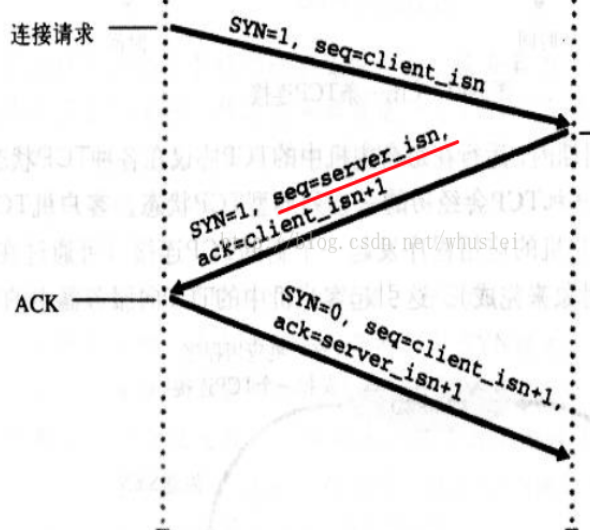
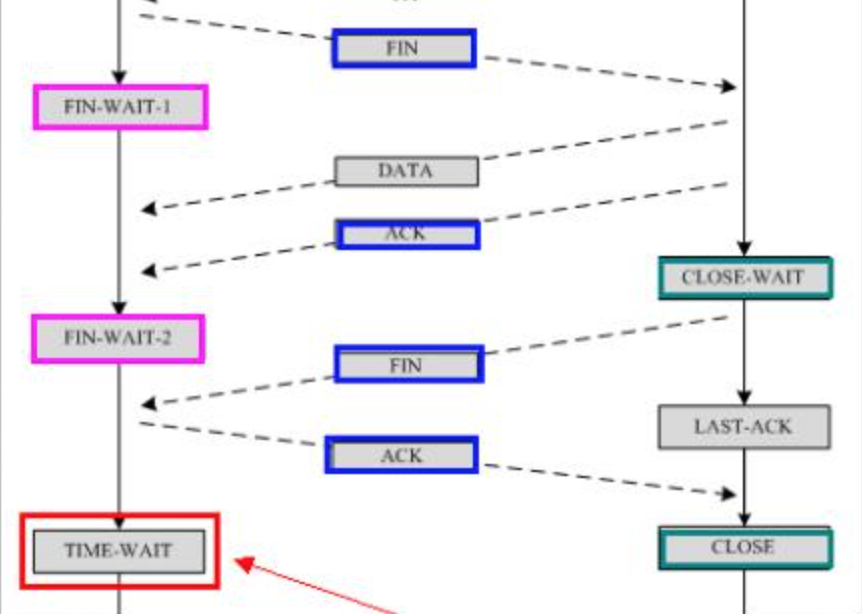

## 握手

一条HTTP或HTTPS请求的发出，需要先建立连接，进行SSL验证，数据传输，连接结束。

### TCP三次握手

TCP建立连接需要进行三次握手。为什么是三次而不是两次，是为了保证每一端至少收到一次确认答复。

第一步：C端向S端发送一个SYN（SYN=j）报文请求建立连接，并进入SYN_SEND状态。
第二步：S端收到SYN报文，回复一个SYN+ACK（SYN=j+1, ACK=k）报文，并进入SYN_RECV状态。
第三步：C端接收到S端的SYN报文，回复一个ACK（ACK=k+1）报文，进入ESTABLEISHED状态。
这样三次握手完成，连接建立成功。

### SSL/TLS四次握手

#### 握手流程：

- 第一步，客户端给出协议版本号、一个客户端生成的随机数（Client random），以及客户端支持的加密方法。
- 第二步，服务器确认双方使用的加密方法，并给出数字证书、以及一个服务器生成的随机数（Server random）。
- 第三步，客户端确认数字证书有效，然后生成一个新的随机数（Premaster secret），并使用数字证书中的公钥，加密这个随机数，发给鲍勃。
- 第四步，服务器使用自己的私钥，获取爱丽丝发来的随机数（即Premaster secret）。
- 第五步，客户端和服务器根据约定的加密方法，使用前面的三个随机数，生成"会话密钥"（session key），用来加密接下来的整个对话过程。

前面四步已经完成握手验证，第五步为服务器生成维持安全连接的会话密钥。

#### 会话密钥：

握手阶段是为了生成`会话密钥`。证书中的公钥和服务器的私钥只是为了加解密`回话密钥`使用的。
（1）生成对话密钥一共需要三个随机数。
（2）握手之后的对话使用`对话密钥`加密（对称加密），服务器的公钥和私钥只用于加密和解密"对话密钥"（非对称加密），无其他作用。
（3）服务器公钥放在服务器的数字证书之中。

#### 连接恢复：

两种方法可以恢复原来的session：一种叫做`session ID`，另一种叫做`session ticket`。

session ID的思想很简单，就是每一次对话都有一个编号（session ID）。如果对话中断，下次重连的时候，只要客户端给出这个编号，且服务器有这个编号的记录，双方就可以重新使用已有的"对话密钥"，而不必重新生成一把。

session ID是目前所有浏览器都支持的方法，但是它的缺点在于session ID往往只保留在一台服务器上。所以，如果客户端的请求发到另一台服务器，就无法恢复对话。session ticket就是为了解决这个问题而诞生的，目前只有Firefox和Chrome浏览器支持。

客户端不再发送session ID，而是发送一个服务器在上一次对话中发送过来的session ticket。这个session ticket是加密的，只有服务器才能解密，其中包括本次对话的主要信息，比如对话密钥和加密方法。当服务器收到session ticket以后，解密后就不必重新生成对话密钥了。

### TCP四次握手

TCP连接的断开需要四次握手。断开请求可以由任意一端发起。

第一步：发起端向另一端发送FIN报文，发起连接中断申请
第二步：另一端会返回ACK报文，这时发起端会进入FIN_WAIT状态，连接端口不会关闭，另一端可以继续传输数据
第三步：另一端在没有数据发送之后会向发起端发送FIN报文，请求关闭连接
第四步：发起端收到后会发送ACK确认，并从FIN_WAIT状态进入TIME_WAIT状态。在等待一段时间后，要是没有收到对方消息，则说明报文对方已接收没有丢失。这时可以正式关闭端口连接

FIN报文是向对方说明我已经没有数据需要传输了，我这边可以关闭请求了。TIME_WAIT状态是因为网络是不可靠的，可能对方并没有收到ACK确认消息，对方可能会重发FIN报文。

###为什么连接时三次握手，而关闭却需要四次

因为关闭时另一端可能还有数据需要传输，并不会马上关闭。所以FIN只能单向确认，这样就需要四次握手。

